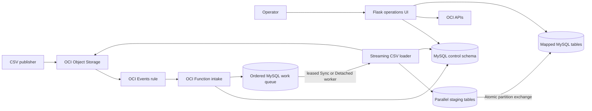

# OCI Object Event to MySQL Table

This application turns OCI Object Storage CSV lifecycle events into controlled,
auditable MySQL table updates. OCI Events routes object create, update, and
delete events to an OCI Function. A mapping selects the target table and either
  Sync or Detached execution. Every event first enters a durable TABLE- or
  MAPPING-bound queue, so overlapping Function invocations cannot reorder
  mutations for the same ownership boundary. CSV rows are streamed into
  parallel staging-table writers, then a partition exchange publishes one
  file's data atomically.

The Flask operations UI provides one place to create and maintain mappings,
manage live OCI Events rules, configure Function capacity, upload or remove test
objects, inspect target and staging tables, and trace event timing, transaction
status, detached work, and errors. This operational view makes setup,
verification, troubleshooting, retry decisions, and orphaned-stage cleanup
available without requiring operators to join OCI Console and control-schema
data manually.

## Application components



## What it does

- Maps a compartment, bucket, and object-name pattern to a pre-approved target
  table.
- Handles create/update by streaming bounded Object Storage ranges into
  parallel database writers without creating a full temporary CSV file.
- Publishes one file atomically with MySQL partition exchange; delete events
  retire the corresponding partition.
- Chooses Sync or Detached processing dynamically from each mapping.
- Binds ordering per target table by default, with an explicit per-mapping
  option for independently owned, non-overlapping partitions.
- Uses a heartbeated lane lease, deterministic event order, completion
  watermark, retry/block states, and safe detached continuation handoff.
- Records raw events, execution mode, lifecycle status, timing, transaction
  audit, queue attempts, worker transport, and actionable error detail.
- Provides operational UI workflows for mappings, live OCI Rules, Function
  configuration, Object Storage testing, registered-table data, stage cleanup,
  Event TX, detached-process monitoring, and queue operations including manual
  enqueue, edit, retry, cancel, and worker wake-up.

## Deployment and configuration

The supported runtime is Python 3.13 or later. The UI uses Flask and Oracle
MySQL Connector/Python `>=9.7,<10`.

On an Oracle Linux deployment host configured with an OCI instance principal:

```sh
cd deploy
./bootstrap.sh
cp env.sh.example env.sh
chmod 600 env.sh
# Set OCI, database, Function, rule, logging, HTTPS, and UI values in env.sh.
./deploy.sh
./deploy_ui.sh
```

`deploy.sh` builds and deploys the Function, discovers its OCID and invoke
endpoint, applies Function timeouts/capacity, and creates or updates the base
Object Storage rule. `deploy_ui.sh` deploys the Flask container behind nginx
HTTPS and discovers the same OCI resources for live rule and Function
management. Keep `deploy/env.sh`, database passwords, OCIR tokens, TLS private
keys, and Flask secrets out of Git.

Before use, confirm:

- Object events are enabled on each source bucket.
- The Events rule covers create, update, and delete and its bucket/object filter
  matches exactly one mapping.
- The Function resource principal can read source objects and can invoke the
  Function for Detached processing.
- The deployment/UI instance principal has the scoped Function, Events,
  Logging, repository, and test-object permissions it needs.
- The Function subnet can reach MySQL and the database account can use the
  control schema plus approved target/staging objects.

See [Deployment, configuration, IAM, and implementation details](docs/technical-details.md)
for environment variables, policies, runtime flow, UI behavior, logging,
troubleshooting, and validation commands.

## Assumptions and limitations

- One CSV file is one complete logical partition of a mapped table. Many files
  may map to one table, but active files must not contain overlapping business
  records.
- Atomicity is limited to one file. Queue binding serializes observed events
  within one table or mapping, but operations across bindings are not one
  transaction.
- Move records between files by completing removal from the source file before
  adding them to the destination, or use an external sequenced publication
  workflow.
- Target tables must already satisfy the loader contract: compatible columns,
  LIST partitioning by `batch_num`, and `batch_num` in every unique key.
- Sync execution is limited to 300 seconds. Detached execution can be
  configured up to 3,600 seconds, but it is still bounded; split very large
  files into ordered, independently owned chunks or use a durable queue.
- OCI Events is at-least-once and may retry or deliver conflicting operations
  out of order. Queue idempotency, reorder grace, and a completion watermark
  protect observed work, but a producer manifest/sequence is still required
  when intent cannot be inferred from arrival and event timestamps.
- A timeout can leave a staging table behind. The UI exposes confirmed cleanup,
  while protecting a target that still has an active loading lease.
- More worker threads help only while MySQL CPU, connection capacity, storage
  throughput, and IOPS have headroom.

## More information

- [Technical deployment and operations guide](docs/technical-details.md)
- [Repeatable performance-test setup and runner](performance_test/README.md)
- [Parallel CSV streaming implementation](docs/csv-stream-parallelization-implementation.md)
- [Diskless parallel CSV streaming implementation](docs/diskless-parallel-csv-streaming-implementation.md)
- [CSV-to-HeatWave ingestion design](blog/csv-ingestion-to-heatwave.md)
- [Large-file technical architecture](blog/technical-architecture-large-csv-heatwave.md)
- [Current VM 6 performance report — MySQL.8 with 1.3 TB storage](external-reports/performance-test-report-vm6-20260719.md)
- [Prior performance baseline — MySQL.8 with 50 GB storage](external-reports/performance-test-report-20260719-sync-detached.md)

The local `reports/` folder is intentionally ignored by Git and retains HTML
plans and working assessment artifacts outside the published documentation.
