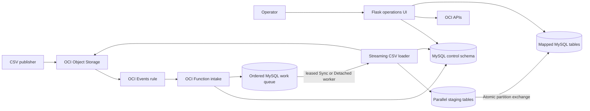

# OCI Object Event to MySQL Table

This application turns OCI Object Storage CSV lifecycle events into controlled,
auditable MySQL table updates. OCI Events routes object create, update, and
delete events to an OCI Function. A mapping selects the target table and either
Sync or Detached execution. Every event first enters a durable TABLE- or
MAPPING-bound queue, so overlapping Function invocations cannot reorder
mutations for the same ownership boundary. CSV rows are streamed into parallel
staging-table writers, then a partition exchange publishes one file's data
atomically.

The Flask operations UI provides one place to create and maintain mappings,
manage live OCI Events rules, configure Function capacity, upload or remove test
objects, inspect target and staging tables, and trace event timing, transaction
status, detached work, and errors. This operational view makes setup,
verification, troubleshooting, retry decisions, and orphaned-stage cleanup
available without requiring operators to join OCI Console and control-schema
data manually.

## Queuing branch summary

The ordered-queue implementation is maintained on the `main-with-queue` branch.
The `v0.1` tag remains the earlier release baseline. This branch adds:

- a durable MySQL queue for every accepted Object Storage event;
- TABLE-bound serialization by default, with explicit MAPPING-bound concurrency
  for independently owned data;
- one heartbeated worker lease per binding, expired-lease recovery, completion
  watermarks, deterministic ordering, and idempotent event intake;
- mapping-driven Sync or Detached execution with safe Detached continuation
  before the Function runtime budget is exhausted;
- immutable requested-mode snapshots and actual worker-transport attempts;
- a Queue UI for depth, status, lane leases, heartbeats, attempts, errors,
  manual enqueue, scheduling edits, retry, cancel, and worker wake-up; and
- ordered CREATE, UPDATE, and DELETE handling without bypassing a blocked head
  entry.

Queueing preserves the order of events already received inside one binding. It
does not make multiple files one transaction and cannot fetch an object version
that a producer deleted before its queued CREATE or UPDATE was processed.

## Application components



## What it does

- Maps a compartment, bucket, and object-name pattern to a pre-approved target
  table.
- Handles create/update by streaming bounded Object Storage ranges into
  parallel database writers without creating a full temporary CSV file.
- Publishes one file atomically with MySQL partition exchange; delete events
  retire the corresponding partition.
- Chooses Sync or Detached processing dynamically from each mapping.
- Binds ordering per target table by default, with an explicit per-mapping
  option for independently owned, non-overlapping partitions.
- Uses a heartbeated lane lease, deterministic event order, completion
  watermark, retry/block states, and safe detached continuation handoff.
- Records raw events, execution mode, lifecycle status, timing, transaction
  audit, queue attempts, worker transport, and actionable error detail.
- Provides operational UI workflows for mappings, live OCI Rules, Function
  configuration, Object Storage testing, registered-table data, stage cleanup,
  Event TX, detached-process monitoring, and queue operations including manual
  enqueue, edit, retry, cancel, and worker wake-up.

## Deployment and configuration

The supported runtime is Python 3.13 or later. The UI uses Flask and Oracle
MySQL Connector/Python `>=9.7,<10`.

### Prerequisites

Before deployment, prepare:

- an Oracle Linux 9 Compute instance with an OCI instance principal;
- a pre-created MySQL control database and target database reachable from the
  Function subnet and deployment VM;
- a database account with the required DDL and DML privileges on both schemas;
- an Object Storage bucket with object events enabled;
- a Function dynamic group and policies that allow the Function resource
  principal to read the configured bucket and invoke the intended Function;
- a deployment/UI dynamic group with scoped access to Functions, OCIR, Events,
  Logging, and any Object Storage test operations used by the UI; and
- an OCI subnet, container repository prefix, OCIR username/auth token, TLS
  choice, and a protected Flask secret.

Target tables must be compatible with the loader contract: LIST partitioning
by the invisible `batch_num` ownership column and `batch_num` included in every
unique key. The UI Data Import workflow can create a compatible table from a
reviewed CSV.

### Fresh setup from `main-with-queue`

Clone the queuing branch and create the protected environment file once:

```sh
cd /home/opc
git clone --branch main-with-queue \
  https://github.com/ivanxma/oci-fn-object-event-2-hw-table.git \
  oci-object-event-2-table
cd /home/opc/oci-object-event-2-table
cp deploy/env.sh.example deploy/env.sh
chmod 600 deploy/env.sh
# Edit deploy/env.sh locally. Never commit it.
./deploy/setup.sh
```

The one-command setup performs the package bootstrap, Function deployment, base
Events-rule reconciliation, UI/nginx HTTPS deployment, and read-only
post-deployment validation. The bootstrap installs OCI/Fn prerequisites,
Podman, nginx, OpenSSL, SELinux helpers, firewalld, jq, and archive/core tools.
The Function and UI use Python 3.13 containers; the older Oracle Linux system
Python is host tooling only.

At minimum, review these queue and execution settings in `deploy/env.sh`:

| Setting | Recommended starting value | Purpose |
| --- | ---: | --- |
| `DETACHED_ENABLED` | `true` | Allows Detached mappings, worker wake-up, and safe continuation from a Sync invocation. |
| `FUNCTION_TIMEOUT` | `300` | Sync Function timeout in seconds. |
| `DETACHED_TIMEOUT_SECONDS` | `3600` | Detached Function timeout in seconds. |
| `QUEUE_LEASE_SECONDS` | `90` | Lane and running-entry lease renewed by heartbeat. |
| `QUEUE_REORDER_GRACE_SECONDS` | `30` | Wait before the first newly received event becomes eligible. |
| `QUEUE_SHUTDOWN_RESERVE_SECONDS` | `120` | Detached runtime held back for safe release and continuation. |
| `QUEUE_MINIMUM_START_SECONDS` | `180` | Minimum remaining Detached budget for another entry. |
| `BATCH_ROWS` | `10000` | Rows per database writer batch. |
| `WRITER_WORKERS` | `4` | Default parallel MySQL writers. |
| `OBJECT_STORAGE_RANGE_BYTES` | `33554432` | Bounded Object Storage range size; 32 MiB. |

Also set the compartment, subnet, region, application/Function names,
repository, database connection, control database, bucket, rule/logging, UI,
and TLS values shown in `deploy/env.sh.example`. `deploy.sh` discovers the
deployed Function OCID and invoke endpoint dynamically and injects both into
the Function configuration.

The control tables are idempotent. On the first Function invocation or first
Queue/Mapping UI access, the application creates or upgrades
`object_storage_mappings`, `queue_lane`, `event_work_queue`, `queue_attempt`,
`queue_transition_audit`, and the event/batch audit tables. Existing mappings
receive safe `TABLE` queue scope by default. No separate queue SQL migration is
required, but the configured database user must be allowed to perform those
control-schema changes.

### Complete setup in the UI

After the deployment validator passes:

1. Open the HTTPS UI and create or select a non-secret connection profile.
2. Authenticate with the approved MySQL account; the password remains in
   server-owned session state and is not saved in the profile.
3. Create or confirm the compatible target table in **Data Import**.
4. Create a **Resource Mapping** for the compartment, bucket, mutually
   exclusive object pattern, target table, requested Sync/Detached mode, writer
   count, and TABLE/MAPPING queue scope.
5. Create or associate an **OCI Rule** that sends create, update, and delete
   events for that mapping to the deployed Function.
6. Use **Object Storage Upload** for a small CSV verification, then confirm the
   result in **Queue**, **Event TX**, **Registered Table**, and **Show Data**.

Use TABLE scope unless separate mappings are guaranteed to own disjoint records
and have no cross-file key, move, update, or deletion dependencies.

### Upgrade an existing deployment

Preserve the existing protected `deploy/env.sh`; do not copy the example over
it. Switch to the queue branch, add/review the queue settings above, enable
Detached execution and its Function-invoke IAM policy, then rerun setup:

```sh
git fetch origin
git switch main-with-queue
git pull --ff-only origin main-with-queue
chmod 600 deploy/env.sh
./deploy/setup.sh
```

The rerun is idempotent and reuses existing generated TLS material. It updates
the Function, its current OCID/invoke endpoint, timeouts/configuration, Events
rule target, UI image, systemd service, nginx configuration, and runtime
validation. Existing non-terminal business work should be allowed to finish or
be reviewed before changing a mapping's queue scope.

### Validation and repeatable reruns

Run the read-only validator independently at any time:

```sh
./deploy/validate.sh
```

It checks the active Function, rule-to-Function association, bucket events,
UI/nginx/container health, protected file modes, Python and Connector/Python
versions, and DB endpoint reachability. For subsequent deployment reruns where
host packages are already known to be current, use:

```sh
./deploy/setup.sh --skip-bootstrap
```

After explicitly setting `PERF_TARGET_DATABASE`, `PERF_TARGET_TABLE`, and the
matching performance prefix/rule values, `--smoke-test` prepares that dedicated
target and runs a 100-row Object Storage create/delete check. Use
`--reset-performance` only when the configured performance target's mutable
state is intended to be reset.

Before use, confirm:

- Object events are enabled on each source bucket.
- The Events rule covers create, update, and delete and its bucket/object filter
  matches exactly one mapping.
- The Function resource principal can read source objects and can invoke the
  Function for Detached processing.
- The deployment/UI instance principal has the scoped Function, Events,
  Logging, repository, and test-object permissions it needs.
- The Function subnet can reach MySQL and the database account can use the
  control schema plus approved target/staging objects.

See [Deployment, configuration, IAM, and implementation details](docs/technical-details.md)
for environment variables, policies, runtime flow, UI behavior, logging,
troubleshooting, and validation commands.

## Assumptions and limitations

- One CSV file is one complete logical partition of a mapped table. Many files
  may map to one table, but active files must not contain overlapping business
  records.
- Atomicity is limited to one file. Queue binding serializes observed events
  within one table or mapping, but operations across bindings are not one
  transaction.
- Move records between files by completing removal from the source file before
  adding them to the destination, or use an external sequenced publication
  workflow.
- Target tables must already satisfy the loader contract: compatible columns,
  LIST partitioning by `batch_num`, and `batch_num` in every unique key.
- Sync execution is limited to 300 seconds. Detached execution can be
  configured up to 3,600 seconds, but it is still bounded; split very large
  files into ordered, independently owned chunks or use an external long-running
  import service.
- OCI Events is at-least-once and may retry or deliver conflicting operations
  out of order. Queue idempotency, reorder grace, and a completion watermark
  protect observed work, but a producer manifest/sequence is still required
  when intent cannot be inferred from arrival and event timestamps.
- A timeout can leave a staging table behind. The UI exposes confirmed cleanup,
  while protecting a target that still has an active loading lease.
- More worker threads help only while MySQL CPU, connection capacity, storage
  throughput, and IOPS have headroom.

## More information

- [Ordered event queue design, workflow, UI, and validation](docs/ordered-event-queue-design.md)
- [Technical deployment and operations guide](docs/technical-details.md)
- [Repeatable performance-test setup and runner](performance_test/README.md)
- [Parallel CSV streaming implementation](docs/csv-stream-parallelization-implementation.md)
- [Diskless parallel CSV streaming implementation](docs/diskless-parallel-csv-streaming-implementation.md)
- [CSV-to-HeatWave ingestion design](blog/csv-ingestion-to-heatwave.md)
- [Large-file technical architecture](blog/technical-architecture-large-csv-heatwave.md)
- [Current VM 6 performance report — MySQL.8 with 1.3 TB storage](external-reports/performance-test-report-vm6-20260719.md)
- [Prior performance baseline — MySQL.8 with 50 GB storage](external-reports/performance-test-report-20260719-sync-detached.md)

The local `reports/` folder is intentionally ignored by Git and retains HTML
plans and working assessment artifacts outside the published documentation.
