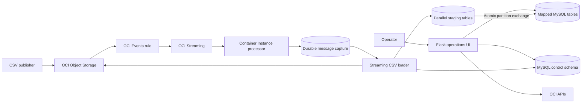

# OCI Object Event to MySQL Table

This application turns OCI Object Storage CSV lifecycle events into controlled,
auditable MySQL table updates. OCI Events routes object create, update, and
delete events to OCI Streaming. A long-running OCI Container Instance processor
captures each stream message durably in MySQL before it invokes the existing
CSV loader. A mapping selects the target table, Stream, and FIFO or parallel
processing mode.

The Flask operations UI provides Stream Server and Stream Content pages,
Object Storage mapping maintenance, live OCI Events rule management, an Event
Processor page for the processor deployment contract, and a separate Durable
Messages page for capture, retry, archive, and retention operations.

## Application components


```mermaid
flowchart LR
    Operator[Operator] --> UI[Flask operations UI]
    UI --> Control[(MySQL control schema)]
    UI --> OCIAPI[OCI APIs]
    UI --> Target[(Mapped MySQL tables)]
    Publisher[CSV publisher] --> Bucket[OCI Object Storage]
    Bucket --> Events[OCI Events rule]
    Events --> Stream[OCI Streaming]
    Stream --> Processor[Container Instance processor]
    Processor --> Capture[(Durable message capture)]
    Capture --> Loader[Streaming CSV loader]
    Loader --> Bucket
    Loader --> Stage[(Parallel staging tables)]
    Stage -->|Atomic partition exchange| Target
    Loader --> Control
```

## What it does

- Maps a compartment, bucket, and object-name pattern to a pre-approved target
  table.
- Handles create/update by streaming bounded Object Storage ranges into
  parallel database writers without creating a full temporary CSV file.
- Publishes one file atomically with MySQL partition exchange. A matching
  delete event drops that file's owned target-table partition; it does not
  truncate and retain an empty partition.
- Chooses FIFO (one Stream partition/one processor) or parallel partition
  assignments from each mapping.
- Captures raw Stream events before processing, so failed records can be
  retried independently of Stream cursor retention.
- Provides operational UI workflows for Streams, mappings, live OCI Rules,
  processor orchestration, Object Storage testing, registered-table data, and
  captured-message retry.

## Deployment and configuration

The supported runtime is Python 3.13 or later. The UI uses Flask and Oracle
MySQL Connector/Python `>=9.7,<10`.

On an Oracle Linux deployment host configured with an OCI instance principal,
run production deployment scripts from `deploy/` and validation harnesses from
`tests/integration/`:

```sh
./deploy/bootstrap_streaming.sh
# Recommended on the UI/deployment VM: discover compartment/region and choose
# AD, VCN, subnet, Vault, enabled AES key, and database secret interactively.
./deploy/setup_env.sh
# Or copy env.sh.example and fill only its mandatory settings.
./deploy/build_processor_image.sh
./tests/integration/verify_streaming_deployment.sh
# Optional bounded integration check against the configured durable database.
# On OL9 it uses the project-local Python 3.12 verifier environment.
./tests/integration/verify_durable_capture.sh
# Disposable create/delete verification. Set FLOW_MANAGED_STREAM=true in the
# validation overlay so each run creates and deletes a fresh Stream as well as
# its uniquely named OCI/DB resources.
./tests/integration/verify_fifo_flow.sh
./tests/integration/verify_parallel_flow.sh
./deploy/deploy_ui.sh
# Only after the documented full verification gate:
./deploy/deploy_processor.sh
```

`build_processor_image.sh` builds and pushes the non-root processor image using
the deployment host's instance-principal OCIR credential helper; it never uses
a static registry credential. Interactive and silent setup derive
`OCI_REGISTRY_REPOSITORY` from the repository prefix and Processor image name,
persist it in the generated `env.sh`, and use that same value for the image
build and the Event Processor image-tag dropdown. `deploy_processor.sh` creates
one Container Instance for one explicit partition assignment. Set
`PROCESSOR_DB_SECRET_OCID` for a mapping-specific replacement that must use a
different Vault database bundle without changing the deployment host's default
`DB_SECRET_OCID`. `deploy_ui.sh`
deploys the Flask container behind nginx HTTPS. Keep `deploy/env.sh`, database
credentials, Vault values, TLS private keys, and Flask secrets out of Git.
The selected Vault secret must be a JSON object containing `host`, `port`,
`user`, `credential`, `database`, `control_database`, `stream_data_database`,
and `staging_database`. The staging database is dedicated to transient loader
tables and must not be used as a Resource Mapping target.
Plain-text password-only Vault secrets are not accepted.
The selected Vault and key become the default choices in the Database Secret
tab; they are OCIDs, not secret material.
All `stream_db` and `stream_data` initialization DDL is stored under
`loader_core/sql/`, `processor/sql/`, or `ui/myapp/sql/`; see the external
database schema inventory in `docs/technical-details.md`.
The dedicated staging schema is created from
`loader_core/sql/init_staging_schema.sql`. The Vault database user must either
be allowed to create that schema or the DBA must pre-create it and grant the
user all required DDL/DML privileges on it.
Unit tests, integration harnesses, and disposable SQL fixtures live under
`tests/`; production processor images do not copy them.

### Database deployment prerequisite

Before running setup or deployment, a DBA must create the streaming database
user and the four schemas it will access. The first three are application
schemas; `<target_db>` is the user-data schema selected by a Resource Mapping
and is not a global loader-database setting.

```sql
CREATE DATABASE IF NOT EXISTS stream_db;
CREATE DATABASE IF NOT EXISTS stream_data;
CREATE DATABASE IF NOT EXISTS stream_staging;
CREATE DATABASE IF NOT EXISTS <target_db>;

CREATE USER IF NOT EXISTS 'stream_user'@'%' IDENTIFIED BY '<secure-password>';
GRANT ALL ON stream_db.* TO 'stream_user'@'%';
GRANT ALL ON stream_data.* TO 'stream_user'@'%';
GRANT ALL ON stream_staging.* TO 'stream_user'@'%';
GRANT ALL ON <target_db>.* TO 'stream_user'@'%';
```

Use site-approved host restrictions, TLS requirements, password policy, and
credential rotation in the actual `CREATE USER` statement. If mappings target
more than one user-data schema, grant the required privileges on each approved
target schema. Store this connection in OCI Vault as the processor JSON secret;
do not put its password in `env.sh`.

For a fresh OL9 validation VM, create a mode-`0600` password file containing
only the database password and a separate mode-`0600` installer config with
the bucket, database host/user, and absolute password-file path:

```sh
# A brand-new OL9 image does not include Git; this is the only prerequisite
# needed before cloning the repository and invoking its installer.
sudo dnf install -y git

export OBJECT_STORAGE_BUCKET_NAME='existing-bucket'
export DB_HOST='mysql-private-host'
export DB_PORT='3306'
export DB_USER='stream_user'
export DB_PASSWORD_FILE='/absolute/path/to/db-password'
```

Add `DB_NAME`, `CONTROL_DATABASE`, `STREAM_DATA_DB_NAME`, and
`STAGING_DATABASE` only when they differ from the documented defaults. If the
compartment contains multiple active Vaults or AES keys, add the selected
`VAULT_ID` and `VAULT_KEY_ID`; a unique Vault/key pair is selected
automatically. Then run:

```sh
./deploy/install_validation_vm.sh --config /path/to/validation-install.env
```

The installer creates or updates `stream_hw_secret_key`, atomically writes its
OCID (not its content) into ignored `deploy/env.sh`, and removes the password
file. Supplying an existing `DB_SECRET_OCID` is supported for reuse or
migration, but is not the clean-install verification path.

Control, durable, and staging database names default to `stream_db`,
`stream_data`, and `staging_db`; override them in the config only when the
selected Vault secret uses isolated validation schemas. This non-interactive
path bootstraps packages, derives instance/region/AD/VCN
and Vault/key metadata, selects a private Processor subnet in the UI VM's VCN,
generates ignored `env.sh`, builds and pushes the
processor with instance-principal authentication, initializes the external SQL
schemas, runs preflight/durable verification, and deploys the HTTPS UI.

Before use, confirm:

- Object events are enabled on each source bucket.
- The Events rule covers create, update, and delete and its bucket/object filter
  matches exactly one mapping.
- The processor resource principal can read source objects, consume the Stream,
  and read the DB secret from Vault.
- The deployment/UI instance principal has scoped Streaming, Events,
  Container Instance, repository, and test-object permissions.
- The processor subnet can reach MySQL and the database account can use the
  control schema plus approved target/staging objects.
- The UI VM may use a public subnet for HTTPS access. Processor Container
  Instances use a subnet in the same VCN with public IP assignment prohibited;
  a public UI subnet is never reused as the Processor subnet.

### IAM policy baseline

Use the dynamic group that contains the UI/deployment VM instance principal.
The Container Instance policy resource family is `compute-container-family`
(not `container-instances` or `container-instances-family`). Replace
`<dynamic-group>`, `<compartment>`, and `<tag-namespace>` below with your own
OCI names. A deployment requires a policy bundle; it is not sufficient to
grant only Container Instance access:

```text
Allow dynamic-group <dynamic-group> to manage compute-container-family in compartment <compartment>
Allow dynamic-group <dynamic-group> to use virtual-network-family in compartment <compartment>
Allow dynamic-group <dynamic-group> to manage streams in compartment <compartment>
Allow dynamic-group <dynamic-group> to read secrets in compartment <compartment>
Allow dynamic-group <dynamic-group> to read secret-bundles in compartment <compartment>
Allow dynamic-group <dynamic-group> to manage repos in compartment <compartment>
```

`compute-container-family` permits Event Processor list/create/manage
operations. `virtual-network-family` permits VNIC/subnet attachment. Streams
cover the UI Stream Server/Content operations and processor assignment. `read
secrets` lists metadata for the UI selector; `read secret-bundles` retrieves
the selected value at runtime. Repositories permit the approved OCIR image
workflow through the instance principal.

## Straight-through setup and release stamps

`deploy/env.sh` is a mode-`0600`, minimal input file. It stores the default
Object Storage bucket, database schema names, the processor Vault secret OCID,
and immutable UI/processor image tags. The deployment VM derives compartment,
region, availability domain, VCN, private Processor subnet, and Object Storage
namespace through its instance principal; these values are not required in
`env.sh`.

Run `./deploy/setup_env.sh` interactively to select an existing Vault and AES
key, provide database connectivity, and create or update the default processor
secret named `stream_hw_secret_key`. For unattended setup use either an
existing `DB_SECRET_OCID` or `--db-password-file PATH`. The password file must
be mode `0600`; after Vault creation/update, setup atomically writes the
resulting OCID to `env.sh` and removes that input file. Passwords are never
written to `env.sh`.

Both images carry a secret-free release stamp: version/tag, Git revision,
source branch, build UTC, and configuration schema version. Settings displays
the UI release and deployment history; durable captures and transaction logs
retain the processor release stamp that processed each message.
Successful `deploy_ui.sh`, direct `deploy_processor.sh`, and UI-orchestrated
Processor deployments append a secret-free row to the control database
`deployment_history` table. Recording uses the Vault bundle in memory and
never writes database credentials into the history record or deployment log.

To enable the Event Processor **Database Secret** tab to create a new JSON
database-connectivity secret, grant the UI/deployment principal the following
additional least-privilege permissions in the compartment containing the
selected Vault and key:

```
Allow dynamic-group <dynamic-group> to manage secrets in compartment <compartment>
Allow dynamic-group <dynamic-group> to use secret-family in compartment <compartment>
Allow dynamic-group <dynamic-group> to read vaults in compartment <compartment>
Allow dynamic-group <dynamic-group> to read keys in compartment <compartment>
Allow dynamic-group <dynamic-group> to use keys in compartment <compartment>
```

The create form requires an existing Vault OCID and a symmetric encryption-key
OCID from that Vault. It sends the submitted connection JSON directly to OCI
Vault and returns only the resulting secret OCID; it does not store or display
the credential. `use secret-family` is required for the `CreateSecret`
operation in addition to `manage secrets`. The processor resource principal still needs only `read
secret-bundles` to resolve that OCID at runtime.

If the deployment applies **defined tags** (freeform tags do not need this),
also grant use of the approved tag namespace at tenancy scope:

```text
Allow dynamic-group <dynamic-group> to use tag-namespaces in tenancy
```

Apply least privilege to the actual processor resource-principal dynamic group
as well. It must be able to consume the assigned Stream, read the Vault bundle,
read source Object Storage objects, and reach MySQL. Verify each permission
with read-only preflight checks before enabling Container Instance creation.

See [Deployment, configuration, IAM, and implementation details](docs/technical-details.md)
for environment variables, policies, runtime flow, UI behavior, logging,
troubleshooting, and validation commands.

## Assumptions and limitations

- One CSV file is one complete logical partition of a mapped table. Many files
  may map to one table, but active files must not contain overlapping business
  records.
- FIFO requires one Stream partition and one processor; parallel mode allows
  independent partition processing and does not guarantee global FIFO order.
- Move records between files by completing removal from the source file before
  adding them to the destination, or use an external sequenced publication
  workflow.
- Target tables must already satisfy the loader contract: compatible columns,
  LIST partitioning by `batch_num`, and `batch_num` in every unique key.
- The seed partition remains by design. A header-only active CSV may also own
  an empty partition; empty partitions for deleted source objects indicate
  legacy or interrupted processing and can be reconciled against
  `source_object_batches`.
- MySQL limits a non-NDB table to 8,192 partitions in total, including
  subpartitions. Because this loader retains one seed partition and assigns one
  partition to each active source file, a target table can hold at most 8,191
  active file-owned partitions. This is a concurrent active-file limit, not a
  lifetime import count: a successfully deleted file has its partition dropped
  and releases that capacity. Set an operational alert below the hard limit,
  because very large partition counts can become impractical before 8,192.
  See the [MySQL 9.7 partitioning restrictions and
  limitations](https://dev.mysql.com/doc/refman/9.7/en/partitioning-limitations.html).
- Do not delete Object Storage files merely to reduce the partition count while
  their mapping rule is enabled. The resulting delete events are published to
  Streaming and intentionally drop the corresponding target-table partitions,
  removing those rows. First disable the mapping's OCI Events rule (or replace
  its condition so the archived objects cannot match), confirm that processing
  has drained, and then perform the approved archival or consolidation work.
- To retain data while reducing the count, an administrator can manually
  consolidate several immutable `p_batch_*` LIST partitions into one partition,
  or move historical rows to a dedicated archive table and then remove the
  original partitions. A merged partition no longer has the normal
  one-file/one-partition boundary: later create, update, or delete events for
  any merged source file are incompatible with the standard loader path.
  Keep those objects excluded from the rule before re-enabling it, record the
  consolidation in operational metadata, and test retry/delete behavior.
  Sharding independent datasets across multiple target tables is the safer
  option when source files must remain individually mutable.
- The processor is long-running; each Stream message is captured before loading
  so a failed loader invocation remains retryable after a processor restart.
- OCI Events is at-least-once and may retry or deliver conflicting operations
  out of order. Publishers must avoid simultaneous updates to the same logical
  data set.
- A timeout can leave a staging table behind. The UI exposes confirmed cleanup,
  while protecting a target that still has an active loading lease. Staging
  tables are created in `staging_database`, never in the mapped user database.
- More worker threads help only while MySQL CPU, connection capacity, storage
  throughput, and IOPS have headroom.

## More information

- [Technical deployment and operations guide](docs/technical-details.md)
