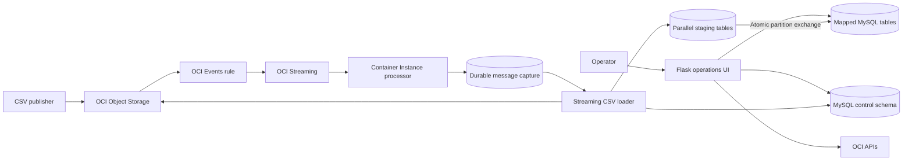

# OCI Object Event to MySQL Table

This application turns OCI Object Storage CSV lifecycle events into controlled,
auditable MySQL table updates. OCI Events routes object create, update, and
delete events to OCI Streaming. A long-running OCI Container Instance processor
captures each stream message durably in MySQL before it invokes the existing
CSV loader. A mapping selects the target table, Stream, and FIFO or parallel
processing mode.

The Flask operations UI provides Stream Server and Stream Content pages,
Object Storage mapping maintenance, live OCI Events rule management, an Event
Processor page for the processor deployment contract, and a separate Durable
Messages page for capture, retry, archive, and retention operations.

## Application components


```mermaid
flowchart LR
    Operator[Operator] --> UI[Flask operations UI]
    UI --> Control[(MySQL control schema)]
    UI --> OCIAPI[OCI APIs]
    UI --> Target[(Mapped MySQL tables)]
    Publisher[CSV publisher] --> Bucket[OCI Object Storage]
    Bucket --> Events[OCI Events rule]
    Events --> Stream[OCI Streaming]
    Stream --> Processor[Container Instance processor]
    Processor --> Capture[(Durable message capture)]
    Capture --> Loader[Streaming CSV loader]
    Loader --> Bucket
    Loader --> Stage[(Parallel staging tables)]
    Stage -->|Atomic partition exchange| Target
    Loader --> Control
```

## What it does

- Maps a compartment, bucket, and object-name pattern to a pre-approved target
  table.
- Handles create/update by streaming bounded Object Storage ranges into
  parallel database writers without creating a full temporary CSV file.
- Publishes one file atomically with MySQL partition exchange. A matching
  delete event drops that file's owned target-table partition; it does not
  truncate and retain an empty partition.
- Chooses FIFO (one Stream partition/one processor) or parallel partition
  assignments from each mapping.
- Captures raw Stream events before processing, so failed records can be
  retried independently of Stream cursor retention.
- Provides operational UI workflows for Streams, mappings, live OCI Rules,
  processor orchestration, Object Storage testing, registered-table data, and
  captured-message retry.

## Deployment and configuration

Follow this order for a new deployment. Do not run setup until the OCI resources,
database schemas/account, and IAM permissions in the prerequisites are ready.
Setup discovers and configures existing infrastructure; it is not a DB System
or IAM provisioning tool.

1. [Prepare infrastructure, database, IAM, registry and Vault](#prerequisites).
2. [Clone main and prepare the deployment host](#prepare-the-deployment-host).
3. [Choose interactive or unattended setup](#configure-and-install).
4. [Publish the release and activate the UI](#publish-the-release-and-activate-the-ui).
5. [Verify and configure the application before production processing](#verify-and-configure-the-application).
6. [Deploy or replace Processors](#deploy-or-replace-processors).

For the complete installation, upgrade, rollback and database migration
procedures, see the [setup and deployment guide](docs/setup-and-deployment-guide.md).

## Prerequisites

### 1. Provision OCI infrastructure and connectivity

- An Oracle Linux 9 UI/deployment VM with an instance principal and sudo access.
- A VCN with a private Processor subnet that prohibits public IP assignment.
  The UI VM and Processor subnet must be in the same VCN; do not reuse a public
  UI subnet for Processor Container Instances.
- A provisioned MySQL/HeatWave DB System reachable from the UI VM and Processor
  subnet. Confirm routing, DNS, TCP/3306 and account host restrictions.
- Network access to the required OCI APIs, Streaming, Object Storage, Vault and
  OCIR, plus package/source endpoints used by bootstrap and image builds.
- An Object Storage bucket with object-event emission enabled.
- An existing OCIR repository, active Vault and enabled symmetric AES key.
- Dynamic-group membership for the UI/deployment VM and Processor resource
  principals, with the permissions in step 3.
- Inbound HTTPS access to the UI through the NSG/security list and host firewall.
  Use a trusted TLS certificate for production; self-signed certificates are
  for approved validation environments only.

### 2. Prepare MySQL schemas and the streaming account

Before running setup or deployment, a DBA must create the streaming database
user and the four schemas it will access. The first three are application
schemas; `<target_db>` is the user-data schema selected by a Resource Mapping
and is not a global loader-database setting.

```sql
CREATE DATABASE IF NOT EXISTS stream_db;
CREATE DATABASE IF NOT EXISTS stream_data;
CREATE DATABASE IF NOT EXISTS stream_staging;
CREATE DATABASE IF NOT EXISTS <target_db>;

CREATE USER IF NOT EXISTS 'stream_user'@'%' IDENTIFIED BY '<secure-password>';
GRANT ALL ON stream_db.* TO 'stream_user'@'%';
GRANT ALL ON stream_data.* TO 'stream_user'@'%';
GRANT ALL ON stream_staging.* TO 'stream_user'@'%';
GRANT ALL ON <target_db>.* TO 'stream_user'@'%';
```

Use site-approved host restrictions, TLS requirements, password policy, and
credential rotation in the actual `CREATE USER` statement. If mappings target
more than one user-data schema, grant the required privileges on each approved
target schema. Store this connection in OCI Vault as the processor JSON secret;
do not put its password in `env.sh`.

### 3. Configure IAM before setup

Replace the placeholders with deployment-specific names and scope each policy
to the appropriate compartment:

```text
Allow dynamic-group <ui-deployment-dynamic-group> to manage compute-container-family in compartment <compartment>
Allow dynamic-group <ui-deployment-dynamic-group> to use virtual-network-family in compartment <compartment>
Allow dynamic-group <ui-deployment-dynamic-group> to manage streams in compartment <compartment>
Allow dynamic-group <ui-deployment-dynamic-group> to manage cloudevents-rules in compartment <compartment>
Allow dynamic-group <ui-deployment-dynamic-group> to manage repos in compartment <compartment>
Allow dynamic-group <ui-deployment-dynamic-group> to read vaults in compartment <compartment>
Allow dynamic-group <ui-deployment-dynamic-group> to read keys in compartment <compartment>
Allow dynamic-group <ui-deployment-dynamic-group> to use keys in compartment <compartment>
Allow dynamic-group <ui-deployment-dynamic-group> to manage secrets in compartment <compartment>
Allow dynamic-group <ui-deployment-dynamic-group> to use secret-family in compartment <compartment>
Allow dynamic-group <ui-deployment-dynamic-group> to read secret-bundles in compartment <compartment>
Allow dynamic-group <ui-deployment-dynamic-group> to read objectstorage-namespaces in compartment <compartment>
Allow dynamic-group <ui-deployment-dynamic-group> to manage objects-family in compartment <compartment>
```

The Container Instance family name is `compute-container-family`. If defined
tags are applied, add `use tag-namespaces` for the approved namespace at the
required scope.

Processor resource principals need the smaller runtime subset: consume the
assigned Stream, read the selected secret bundle, read source objects, and use
the configured network. Do not configure registry usernames or authentication
tokens; image build and push use the deployment VM instance principal.

The Vault/key permissions above are needed before interactive or unattended
setup creates the database secret, not only when using the UI Database Secret
tab later. The Processor should receive only its runtime permissions, not the
UI/deployment principal's management permissions. Apply the policy bundle in
the compartments that actually contain the resources.

### 4. Confirm the registry and Vault inputs

The deployment requires one deployment-owned OCIR repository in the UI VM's
compartment. Create this repository before setup and provide its OCID as the
mandatory `OCI_REGISTRY_REPOSITORY_ID`. The instance principal must have
`manage repos` permission in that compartment and `docker-credential-ocir`
must be installed before image publication (the bootstrap step below installs
it). Setup validates the repository OCID, lifecycle, and
compartment, resolves its name, and persists both values. All Processor and UI
releases use this same repository:

```text
<region-key>.ocir.io/<namespace>/<repository>:processor-<processor-version>
<region-key>.ocir.io/<namespace>/<repository>:ui-<ui-version>
```

Both tag types are immutable. Event Processor includes only `processor-*` tags
in its Container image selector, so UI and unqualified image tags cannot be
deployed to OCI Container Instances.

The selected Vault must be active and its symmetric AES key enabled. Setup can
create or update the database secret, but it does not create the Vault, key,
DB System, streaming account, or its grants. The selected secret must contain:

```json
{
  "host": "mysql-private-host",
  "port": 3306,
  "user": "stream_user",
  "credential": "<database-password>",
  "database": "testdb",
  "control_database": "stream_db",
  "stream_data_database": "stream_data",
  "staging_database": "stream_staging"
}
```

Plain-text password-only secrets are not accepted. Match the bundle to the
schemas and grants prepared above. The staging schema is dedicated to transient
loader tables and must never be a Resource Mapping target. Keep credentials,
Vault values, TLS private keys, Flask secrets, and `deploy/env.sh` out of Git.

## Prepare the deployment host

Clone the default `main` branch on the OL9 VM:

```sh
sudo dnf install -y git
git clone --branch main https://github.com/ivanxma/oci-fn-object-event-2-hw-table.git
cd oci-fn-object-event-2-hw-table
```

All following commands run from this repository root. The application runtime
is Python 3.13 or later; the images provide that runtime. Manual deployment
migrations and verification on OL9 use the separate Python 3.12 environment
created below. The UI uses Flask and MySQL Connector/Python `>=9.7,<10`.

## Configure and install

Choose **one** initial-install path. Both require all prerequisites above.

### Option A: Interactive setup

Bootstrap the host tools before running the resource-selection prompts:

```sh
./deploy/bootstrap_streaming.sh
./deploy/setup_env.sh
```

Bootstrap installs the OCI CLI, container tools and instance-principal OCIR
credential helper. Setup discovers deployment context and selects the private
subnet, repository, Vault, AES key and database connection. Review the generated
configuration before publishing images.

`deploy/env.sh` is a mode-`0600`, minimal input file. It stores the default
Object Storage bucket, database schema names, the processor Vault secret OCID,
and immutable UI/processor image tags. The deployment VM derives compartment,
region, availability domain, VCN, private Processor subnet, and Object Storage
namespace through its instance principal; these values are not required in
`env.sh`.

Run `./deploy/setup_env.sh` interactively to select an existing Vault and AES
key, provide database connectivity, and create or update the default processor
secret named `stream_hw_secret_key`. For unattended setup use either an
existing `DB_SECRET_OCID` or `--db-password-file PATH`. The password file must
be mode `0600`; after Vault creation/update, setup atomically writes the
resulting OCID to `env.sh` and removes that input file. Passwords are never
written to `env.sh`.

Create the host Python environment **before the first manual release**;
`publish_release.sh` needs it to apply database migrations:

```sh
sudo dnf install -y python3.12 python3.12-pip
python3.12 -m venv .venv-verification-py312
./.venv-verification-py312/bin/python -m pip install --upgrade pip
./.venv-verification-py312/bin/python -m pip install -r ui/requirements.txt
```

Alternatively, set `DEPLOYMENT_PYTHON_BIN` to an executable Python environment
that can import both `mysql.connector` and `oci`. Continue to publication below.

### Option B: Unattended validation-VM installation

After completing the prerequisites and cloning the repository, create a
mode-`0600` password file containing only the database password and a separate
mode-`0600` installer config with the bucket, repository OCID, database
host/user, and absolute password-file path:

```sh
# Save these exports in the mode-0600 installer config, not just the shell.
export OBJECT_STORAGE_BUCKET_NAME='existing-bucket'
export OCI_REGISTRY_REPOSITORY_ID='ocid1.containerrepo...'
export DB_HOST='mysql-private-host'
export DB_PORT='3306'
export DB_USER='stream_user'
export DB_PASSWORD_FILE='/absolute/path/to/db-password'
```

Add `DB_NAME`, `CONTROL_DATABASE`, `STREAM_DATA_DB_NAME`, and
`STAGING_DATABASE` only when they differ from the documented defaults. If the
compartment contains multiple active Vaults or AES keys, add the selected
`VAULT_ID` and `VAULT_KEY_ID`; a unique Vault/key pair is selected
automatically. Then run:

```sh
./deploy/install_validation_vm.sh --config /path/to/validation-install.env
```

The installer creates or updates `stream_hw_secret_key`, atomically writes its
OCID (not its content) into ignored `deploy/env.sh`, and removes the password
file. Supplying an existing `DB_SECRET_OCID` is supported for reuse or
migration, but is not the clean-install verification path.

The default target, control, durable, and staging database names are `testdb`,
`stream_db`, `stream_data`, and `stream_staging`; override them to match the
schemas prepared for this deployment. The installer discovers OCI context,
selects a private Processor subnet in the UI VM's VCN, generates ignored
`env.sh`, initializes the external SQL structures, runs preflight/durable
verification, publishes images with instance-principal authentication, and
deploys the HTTPS UI.

This installer includes bootstrap, setup, the host Python environment and the
initial release publication. Do not run Option A or immediately publish another
release after a successful installation; continue to application verification.

## Publish the release and activate the UI

Run release commands on the UI/deployment VM after the interactive path has generated
`deploy/env.sh` and installed the release Python environment. The unattended
installer already performs the initial publication; use this section for later
releases on that path. The VM instance principal supplies OCIR authentication; do not
use a registry username or authentication token.

Publish both components and activate the UI with one version:

```sh
cd /home/opc/oci-fn-object-event-2-hw-table
git switch main
git pull --ff-only origin main
VERSION="$(date -u +%Y%m%dT%H%M%SZ)-$(git rev-parse --short HEAD)"
./deploy/publish_release.sh --version "$VERSION"
```

The command loads `env.sh`, applies the external database migrations, publishes
sortable timestamp-and-SHA `processor-<version>` and `ui-<version>` tags in the
configured repository, switches the systemd UI service to the exact UI tag, and
records its secret-free release history.

If the process stopped only after publishing the Processor tag, continue the
same version without overwriting that immutable tag:

```sh
./deploy/publish_release.sh --version "$VERSION" --resume
```

For a Processor-only publication, with no UI build or service change:

```sh
./deploy/publish_release.sh --version "$VERSION" --skip-ui
```

The lower-level component commands remain available for diagnostics:

```sh
PROCESSOR_IMAGE_TAG_OVERRIDE="$VERSION" ./deploy/build_processor_image.sh
UI_IMAGE_TAG_OVERRIDE="$VERSION" ./deploy/deploy_ui.sh
```

Prefer `publish_release.sh` for normal releases because it applies migrations
before UI activation and guarantees matching component versions. Direct
Processor builds reject an existing tag.

Both images carry a secret-free release stamp: version/tag, Git revision,
source branch, build UTC, and configuration schema version. Settings displays
the UI release and deployment history; durable captures and transaction logs
retain the processor release stamp that processed each message.
Successful `deploy_ui.sh`, direct `deploy_processor.sh`, and UI-orchestrated
Processor deployments append a secret-free row to the control database
`deployment_history` table. Recording uses the Vault bundle in memory and
never writes database credentials into the history record or deployment log.

## Verify and configure the application

Verify the activated release:

```sh
./deploy/service_status.sh
# Shows the UI container, nginx, Processor instances, and UI logs. Add --no-logs
# for a compact status-only report, or --log-lines 100 for more UI log history.
sudo systemctl is-active object-storage-heatwave-ui
sudo podman ps --format '{{.Names}} {{.Image}}'
curl -kI https://127.0.0.1/
set -a
source deploy/env.sh
set +a
source deploy/oci_context.sh
oci_context_resolve
oci --auth instance_principal --region "$REGION" \
  artifacts container image list --compartment-id "$COMPARTMENT_ID" --all \
  --query 'data.items[].{repository:"repository-name",tag:version,state:"lifecycle-state"}'
```

Run the deployment preflight and bounded durable-store verification:

```sh
./tests/integration/verify_streaming_deployment.sh
./tests/integration/verify_durable_capture.sh
```

Then configure the flow in the UI:

1. Open `https://<ui-host>/`, select or create a Connection Profile, and sign in
   with a MySQL account authorized on the prepared schemas. UI profiles and the
   Processor Vault secret are separate connection configurations.
2. Check Settings and schema initialization. Releases apply external migrations;
   use the documented initialization workflow if application objects are missing.
   Do not use destructive reinitialization on an existing deployment without backup.
3. Create or verify the target table in Data Import with the OCI event-ready
   layout: invisible `batch_num`, LIST partitioning, and `batch_num` in every
   unique key.
4. Create or select the Stream. FIFO requires one partition; parallel processing
   requires multiple partitions with explicit, disjoint Processor assignments.
5. Create the Resource Mapping for the compartment, bucket, object pattern,
   target and Stream. Configure its OCI Events rule for create/update/delete,
   ensuring the rule's Stream OCID and filters match the intended mapping.

Before production Processor deployment, complete the
[full verification gate](docs/technical-details.md#verification-gates), including
the processor, loader and UI tests and isolated end-to-end harnesses:

```sh
# Configure isolated validation resources first. Set FLOW_MANAGED_STREAM=true
# in the validation overlay to create a fresh disposable Stream for each run.
./tests/integration/verify_fifo_flow.sh
./tests/integration/verify_parallel_flow.sh
```

These harnesses create and delete OCI and database test resources; do not point
them at production mappings or objects. See [tests/README.md](tests/README.md)
for test setup and scope.

## Deploy or replace Processors

Publishing the Processor image does not create or replace a running OCI
Container Instance. After the verification gate, use **Event Processor →
Deployment** to select the mapping, immutable `processor-<version>` image,
current Vault database secret, mode, partition assignment and worker count.

For a replacement, coordinate the handover so old and new instances do not
consume the same partition concurrently. Follow the
[Processor replacement procedure](docs/setup-and-deployment-guide.md#3-replace-processor-deployments)
and verify checkpoints, durable captures, Event TX and target rows before
resuming normal input. Retire the old instance as part of that handover.

For a direct mapping-specific deployment, export the required Stream, mapping,
mode, partition assignment and replica values from the
[deployment contract](docs/technical-details.md#processor-deployment-contract), then run:

```sh
./deploy/deploy_processor.sh
```

The script resolves the authoritative repository OCID and verifies that the
selected immutable Processor tag exists before creating the instance. Use
`PROCESSOR_DB_SECRET_OCID` for a mapping-specific database bundle without
changing the deployment host's default `DB_SECRET_OCID`.

Confirm that the intended instance is ACTIVE and processes a controlled
create/update/delete lifecycle, with exact target rows/partitions and no
unexpected staging tables. Use `./deploy/service_status.sh` for subsequent
UI container, nginx, Processor status and log checks.

## Assumptions and limitations

- One CSV file is one complete logical partition of a mapped table. Many files
  may map to one table, but active files must not contain overlapping business
  records.
- FIFO requires one Stream partition and one processor; parallel mode allows
  independent partition processing and does not guarantee global FIFO order.
- Move records between files by completing removal from the source file before
  adding them to the destination, or use an external sequenced publication
  workflow.
- Target tables must already satisfy the loader contract: compatible columns,
  LIST partitioning by `batch_num`, and `batch_num` in every unique key.
- The seed partition remains by design. A header-only active CSV may also own
  an empty partition; empty partitions for deleted source objects indicate
  interrupted or incomplete processing and can be reconciled against
  `source_object_batches`.
- MySQL limits a non-NDB table to 8,192 partitions in total, including
  subpartitions. Because this loader retains one seed partition and assigns one
  partition to each active source file, a target table can hold at most 8,191
  active file-owned partitions. This is a concurrent active-file limit, not a
  lifetime import count: a successfully deleted file has its partition dropped
  and releases that capacity. Set an operational alert below the hard limit,
  because very large partition counts can become impractical before 8,192.
  See the [MySQL 9.7 partitioning restrictions and
  limitations](https://dev.mysql.com/doc/refman/9.7/en/partitioning-limitations.html).
- Do not delete Object Storage files merely to reduce the partition count while
  their mapping rule is enabled. The resulting delete events are published to
  Streaming and intentionally drop the corresponding target-table partitions,
  removing those rows. First disable the mapping's OCI Events rule (or replace
  its condition so the archived objects cannot match), confirm that processing
  has drained, and then perform the approved archival or consolidation work.
- To retain data while reducing the count, an administrator can manually
  consolidate several immutable `p_batch_*` LIST partitions into one partition,
  or move historical rows to a dedicated archive table and then remove the
  original partitions. A merged partition no longer has the normal
  one-file/one-partition boundary: later create, update, or delete events for
  any merged source file are incompatible with the standard loader path.
  Keep those objects excluded from the rule before re-enabling it, record the
  consolidation in operational metadata, and test retry/delete behavior.
  Sharding independent datasets across multiple target tables is the safer
  option when source files must remain individually mutable.
- The processor is long-running; each Stream message is captured before loading
  so a failed loader invocation remains retryable after a processor restart.
- OCI Events is at-least-once and may retry or deliver conflicting operations
  out of order. Publishers must avoid simultaneous updates to the same logical
  data set.
- A timeout can leave a staging table behind. The UI exposes confirmed cleanup,
  while protecting a target that still has an active loading lease. Staging
  tables are created in `staging_database`, never in the mapped user database.
- More worker threads help only while MySQL CPU, connection capacity, storage
  throughput, and IOPS have headroom.

## More information

- [Setup and deployment guide](docs/setup-and-deployment-guide.md)
- [Technical architecture and scaling guide](docs/technical-architecture.md)
- [Technical deployment and operations guide](docs/technical-details.md)
