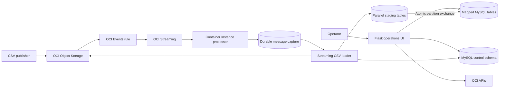

# OCI Object Event to MySQL Table

This application turns OCI Object Storage CSV lifecycle events into controlled,
auditable MySQL table updates. OCI Events routes object create, update, and
delete events to OCI Streaming. A long-running OCI Container Instance processor
captures each stream message durably in MySQL before it invokes the existing
CSV loader. A mapping selects the target table, Stream, and FIFO or parallel
processing mode.

The Flask operations UI provides Stream Server and Stream Content pages,
Object Storage mapping maintenance, live OCI Events rule management, an Event
Processor page for the processor deployment contract, and a separate Durable
Messages page for capture, retry, archive, and retention operations.

## Application components


```mermaid
flowchart LR
    Operator[Operator] --> UI[Flask operations UI]
    UI --> Control[(MySQL control schema)]
    UI --> OCIAPI[OCI APIs]
    UI --> Target[(Mapped MySQL tables)]
    Publisher[CSV publisher] --> Bucket[OCI Object Storage]
    Bucket --> Events[OCI Events rule]
    Events --> Stream[OCI Streaming]
    Stream --> Processor[Container Instance processor]
    Processor --> Capture[(Durable message capture)]
    Capture --> Loader[Streaming CSV loader]
    Loader --> Bucket
    Loader --> Stage[(Parallel staging tables)]
    Stage -->|Atomic partition exchange| Target
    Loader --> Control
```

## What it does

- Maps a compartment, bucket, and object-name pattern to a pre-approved target
  table.
- Handles create/update by streaming bounded Object Storage ranges into
  parallel database writers without creating a full temporary CSV file.
- Publishes one file atomically with MySQL partition exchange; delete events
  retire the corresponding partition.
- Chooses FIFO (one Stream partition/one processor) or parallel partition
  assignments from each mapping.
- Captures raw Stream events before processing, so failed records can be
  retried independently of Stream cursor retention.
- Provides operational UI workflows for Streams, mappings, live OCI Rules,
  processor orchestration, Object Storage testing, registered-table data, and
  captured-message retry.

## Deployment and configuration

The supported runtime is Python 3.13 or later. The UI uses Flask and Oracle
MySQL Connector/Python `>=9.7,<10`.

On an Oracle Linux deployment host configured with an OCI instance principal:

```sh
cd deploy
./bootstrap_streaming.sh
cp env.sh.example env.sh
chmod 600 env.sh
# Set OCI, database, Vault, Stream, image, rule, HTTPS, and UI values in env.sh.
./build_consumer_image.sh
./verify_streaming_deployment.sh
./deploy_ui.sh
# Only after the documented full verification gate:
./deploy_consumer.sh
```

`build_consumer_image.sh` builds and pushes the non-root processor image using
the deployment host's instance-principal OCIR credential helper; it never uses
a static registry credential. `deploy_consumer.sh` creates
one Container Instance for one explicit partition assignment. `deploy_ui.sh`
deploys the Flask container behind nginx HTTPS. Keep `deploy/env.sh`, database
database credentials, Vault values, TLS private keys, and Flask secrets out of Git.

Before use, confirm:

- Object events are enabled on each source bucket.
- The Events rule covers create, update, and delete and its bucket/object filter
  matches exactly one mapping.
- The processor resource principal can read source objects, consume the Stream,
  and read the DB secret from Vault.
- The deployment/UI instance principal has scoped Streaming, Events,
  Container Instance, repository, and test-object permissions.
- The processor subnet can reach MySQL and the database account can use the
  control schema plus approved target/staging objects.

### IAM policy baseline

Use the dynamic group that contains the UI/deployment VM instance principal.
The Container Instance policy resource family is `compute-container-family`
(not `container-instances` or `container-instances-family`). Replace
`<dynamic-group>`, `<compartment>`, and `<tag-namespace>` below with your own
OCI names. A deployment requires a policy bundle; it is not sufficient to
grant only Container Instance access:

```text
Allow dynamic-group <dynamic-group> to manage compute-container-family in compartment <compartment>
Allow dynamic-group <dynamic-group> to use virtual-network-family in compartment <compartment>
Allow dynamic-group <dynamic-group> to manage streams in compartment <compartment>
Allow dynamic-group <dynamic-group> to read secrets in compartment <compartment>
Allow dynamic-group <dynamic-group> to read secret-bundles in compartment <compartment>
Allow dynamic-group <dynamic-group> to manage repos in compartment <compartment>
```

`compute-container-family` permits Event Processor list/create/manage
operations. `virtual-network-family` permits VNIC/subnet attachment. Streams
cover the UI Stream Server/Content operations and processor assignment. `read
secrets` lists metadata for the UI selector; `read secret-bundles` retrieves
the selected value at runtime. Repositories permit the approved OCIR image
workflow through the instance principal.

To enable the Event Processor **Database Secret** tab to create a new JSON
database-connectivity secret, grant the UI/deployment principal the following
additional least-privilege permissions in the compartment containing the
selected Vault and key:

```
Allow dynamic-group <dynamic-group> to manage secrets in compartment <compartment>
Allow dynamic-group <dynamic-group> to use secret-family in compartment <compartment>
Allow dynamic-group <dynamic-group> to read vaults in compartment <compartment>
Allow dynamic-group <dynamic-group> to read keys in compartment <compartment>
Allow dynamic-group <dynamic-group> to use keys in compartment <compartment>
```

The create form requires an existing Vault OCID and a symmetric encryption-key
OCID from that Vault. It sends the submitted connection JSON directly to OCI
Vault and returns only the resulting secret OCID; it does not store or display
the credential. `use secret-family` is required for the `CreateSecret`
operation in addition to `manage secrets`. The processor resource principal still needs only `read
secret-bundles` to resolve that OCID at runtime.

If the deployment applies **defined tags** (freeform tags do not need this),
also grant use of the approved tag namespace at tenancy scope:

```text
Allow dynamic-group <dynamic-group> to use tag-namespaces in tenancy
```

Apply least privilege to the actual processor resource-principal dynamic group
as well. It must be able to consume the assigned Stream, read the Vault bundle,
read source Object Storage objects, and reach MySQL. Verify each permission
with read-only preflight checks before enabling Container Instance creation.

See [Deployment, configuration, IAM, and implementation details](docs/technical-details.md)
for environment variables, policies, runtime flow, UI behavior, logging,
troubleshooting, and validation commands.

## Assumptions and limitations

- One CSV file is one complete logical partition of a mapped table. Many files
  may map to one table, but active files must not contain overlapping business
  records.
- FIFO requires one Stream partition and one processor; parallel mode allows
  independent partition processing and does not guarantee global FIFO order.
- Move records between files by completing removal from the source file before
  adding them to the destination, or use an external sequenced publication
  workflow.
- Target tables must already satisfy the loader contract: compatible columns,
  LIST partitioning by `batch_num`, and `batch_num` in every unique key.
- The processor is long-running; each Stream message is captured before loading
  so a failed loader invocation remains retryable after a consumer restart.
- OCI Events is at-least-once and may retry or deliver conflicting operations
  out of order. Publishers must avoid simultaneous updates to the same logical
  data set.
- A timeout can leave a staging table behind. The UI exposes confirmed cleanup,
  while protecting a target that still has an active loading lease.
- More worker threads help only while MySQL CPU, connection capacity, storage
  throughput, and IOPS have headroom.

## More information

- [Technical deployment and operations guide](docs/technical-details.md)
- [Repeatable performance-test setup and runner](performance_test/README.md)
- [Parallel CSV streaming implementation](docs/csv-stream-parallelization-implementation.md)
- [Diskless parallel CSV streaming implementation](docs/diskless-parallel-csv-streaming-implementation.md)
- [CSV-to-HeatWave ingestion design](blog/csv-ingestion-to-heatwave.md)
- [Large-file technical architecture](blog/technical-architecture-large-csv-heatwave.md)
- [Current VM 6 performance report — MySQL.8 with 1.3 TB storage](external-reports/performance-test-report-vm6-20260719.md)
- [Prior performance baseline — MySQL.8 with 50 GB storage](external-reports/performance-test-report-20260719-sync-detached.md)

The local `reports/` folder is intentionally ignored by Git and retains HTML
plans and working assessment artifacts outside the published documentation.
