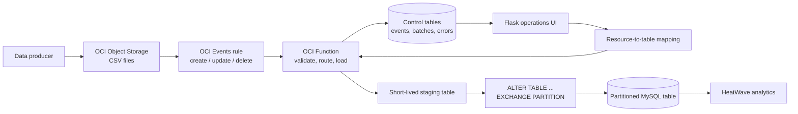

# From CSV in Object Storage to HeatWave: an operational ingestion design

CSV is a convenient landing format, but it becomes difficult to operate at scale. Files may arrive late, be replaced, contain a schema change, or need to be removed. At the same time, analytical users expect a dependable table in MySQL HeatWave rather than a collection of files whose state is unclear.

This post describes an event-driven pattern that turns CSV object changes into controlled MySQL table changes. It combines an OCI Event Rule, an OCI Function, a Flask operations UI, and partition exchange to make ingestion fast, traceable, and reversible.



## The ingestion challenges

The basic `LOAD DATA` command is fast, but production ingestion needs more than loading a file into a table.

- **Schema control.** Headers, delimiters, quoting, character set, required fields, and data types must be checked before a file affects a shared analytical table.
- **Idempotency.** Object Storage can send retries and a file can be overwritten. Processing must identify the object version or event identity and avoid duplicate rows.
- **Concurrent arrivals.** Multiple files for the same target need isolated staging space and clear ownership of their work.
- **Availability.** Long row-by-row inserts or delete-and-reload jobs make tables less predictable for readers.
- **Lifecycle operations.** An object update must replace its prior data; an object delete must remove the associated data without a full-table reload.
- **Observability.** Operators need to answer: What happened to this file? Which table was affected? Did it fail? Can it safely be retried?

HeatWave adds a further operational consideration: the MySQL table is the governed source of truth for analytics. Ingestion should preserve valid MySQL table design, use types appropriate for the workload, and fit the process used to load or refresh data in the HeatWave secondary engine.

## Define the contract before automation

Treat every CSV feed as a data contract. The contract defines the expected object path, target database and table, column mapping, parsing rules, primary or unique keys, partition strategy, and ownership. A file should not choose its destination simply because its name happens to look familiar.

A small control schema provides the contract and audit trail. Typical records are:

| Control record | Purpose |
| --- | --- |
| `object_storage_mappings` | Matches compartment, bucket, and object-name pattern to a target table and load settings. |
| `object_event` | Stores the original OCI event and a normalized object identity. |
| `event_tx_log` | Records each attempted action, batch, timing, status, and target. |
| `event_errors` | Keeps actionable error details separate from successful history. |
| batch registry | Associates a source object with the partition/batch currently represented in the target. |

Keep database credentials in protected Function configuration or a secret-management integration; never place them in an event payload, object metadata, URL, browser state, or application log.

## Automate table creation carefully

There are two sensible models, and the choice should be explicit.

1. **Governed pre-creation.** A database owner creates the target table from a reviewed definition. The ingestion service may only create its temporary staging tables. This is the safest model for shared HeatWave datasets because keys, partitioning, data types, and grants remain intentional.
2. **Template-driven creation.** For approved mappings, the UI generates a reviewed `CREATE TABLE` statement from a versioned template and submits it through a controlled workflow. The Function then verifies the resulting table shape before it loads data.

Avoid allowing a Function to infer and create arbitrary production tables directly from a CSV. Type inference can mistake identifiers for numbers, turn dates into strings, and create a schema that cannot support the intended partition or unique-key rules.

For partition exchange, the target must be designed for it from the outset. A practical approach is a `LIST`-partitioned table using a loader-owned `batch_num` column. If the column is invisible, normal consumer queries remain clean. Every unique key must include the partitioning column, which is a key MySQL design constraint to validate during table setup.

```sql
CREATE TABLE sales_fact (
  order_id BIGINT NOT NULL,
  order_date DATE NOT NULL,
  amount DECIMAL(14,2) NOT NULL,
  batch_num BIGINT NOT NULL INVISIBLE,
  PRIMARY KEY (order_id, batch_num)
)
PARTITION BY LIST (batch_num) (
  PARTITION p_1001 VALUES IN (1001)
);
```

The exact table definition, indexes, and HeatWave loading policy should be sized from representative CSV volumes and query patterns—not guessed from a sample header.

## Why partition exchange is the fast path

For a create or update event, the Function allocates a new batch number for the mapped target, downloads the CSV with its OCI resource principal, and loads the data into a uniquely named staging table. Parallel parsing or writes can be used where the database and file characteristics justify it.

After validation, the Function exchanges the staging table with the target partition:

```sql
ALTER TABLE sales_fact
  EXCHANGE PARTITION p_1001 WITH TABLE sales_fact_stage_7f3c;
```

The exchange changes table metadata instead of copying the staged rows into the target. The result is a short, atomic switch: readers see either the old partition contents or the new partition contents, not a partially loaded file. This reduces the disruptive window and makes it well suited to replacing a file-sized slice of an existing table.

The staging and exchanged tables must be structurally compatible. The loader should check compatibility, constraints, and row counts before the exchange. After a successful exchange, drop the short-lived staging table. If an error occurs, clean it up while retaining the batch and event error history for investigation.

## Updates and removals are first-class events

An object update is not merely a new load. It represents the replacement of a known source object.

1. Receive the update event and resolve the mapping.
2. Allocate a replacement batch and load it into an isolated staging table.
3. Atomically exchange the new batch into the target.
4. Retire the batch associated with the previous object version according to the retention policy.
5. Commit the event transaction status only after the intended table state is reached.

For an object delete event, look up the batch assigned to that object and remove its data with a partition operation such as `ALTER TABLE ... TRUNCATE PARTITION`. This is dramatically more targeted than issuing a broad `DELETE` against a large fact table. It also makes removal auditable: the UI can show the deletion event, affected batch, row estimate, time, and outcome.

Make retries safe. Persist an event ID or object version/ETag identity before processing; mark a batch `LOADING`, `SUCCESS`, or `ERROR`; and use a lease timeout so an abandoned execution can be retried without allowing two active loads for the same object.

## Performance considerations for HeatWave workloads

The speed of a file load is only one part of end-to-end performance.

- Prefer bulk loading into staging over individual inserts. Tune batch size and writer concurrency from measurements; more workers can increase contention rather than throughput.
- Keep files at workable sizes. Very small files cause event and setup overhead; extremely large single files reduce parallelism and make recovery slower.
- Use precise MySQL types, especially for dates, numbers, and identifiers. Unnecessary strings consume more memory and can slow analytic processing.
- Build the essential indexes and partition layout into the target design. Excess secondary indexes slow ingestion; missing access paths hurt non-HeatWave transactional queries.
- Validate CSV encoding, delimiter, quoting, and malformed-row policy before a large load begins.
- Plan HeatWave data loading/refresh as part of the publication path. Record whether the target data is available to the analytic workload after the MySQL exchange, rather than treating the database write as the only success condition.
- Measure and retain timings for download, parse/load, exchange, any HeatWave refresh, and cleanup. These metrics make capacity decisions concrete.

## Operational flow: Event Rule to OCI Function

OCI Object Storage emits lifecycle events; an OCI Events rule filters the relevant bucket and optional object-name pattern and invokes the Function for `createobject`, `updateobject`, and `deleteobject`.

```mermaid
sequenceDiagram
    participant OS as Object Storage
    participant ER as OCI Events rule
    participant F as OCI Function
    participant DB as MySQL control schema
    participant T as Target table
    OS->>ER: Object created, updated, or deleted
    ER->>F: Matching CloudEvent
    F->>DB: Persist raw event; resolve mapping
    alt create or update
        F->>DB: Allocate or retry batch lease
        F->>OS: Download CSV with resource principal
        F->>DB: Load and validate staging table
        F->>T: Exchange staging table with partition
        F->>DB: Mark SUCCESS and link audit records
    else delete
        F->>DB: Find object's active batch
        F->>T: Truncate or retire that partition
        F->>DB: Mark SUCCESS
    else mapping missing or validation fails
        F->>DB: Mark ERROR; write actionable error
    end
```

The Function needs only the permissions required to read source objects and connect to the database. The deployment identity is separate: it creates or updates the Function, Event Rule, logging configuration, and container image. Enable Object Storage object events on the bucket and use a narrowly scoped rule so unrelated objects do not invoke the loader.

## Make the UI an operations console, not a second loader

The Flask UI is where an operator defines and reviews the operable flow:

- register a resource-to-table mapping, including compartment, bucket, path pattern, CSV format, and target;
- validate the target table’s partition and key requirements before activating the mapping;
- show the mapping status and ownership, with approval or activation state where needed;
- list event transactions with source object, action, target, batch, timestamps, row counts, duration, and status;
- link each transaction to its raw Object Storage event and any error record;
- allow safe operations such as retrying a failed eligible event, disabling a mapping, or viewing a paged sample of the target table.

Do not load an entire large table into the browser. Server-page event history and target-table samples. Keep passwords server-side only for the active connection, and apply authorization to mapping changes and retry actions.

## Track events through to an issue

Operational visibility closes the loop. Every Function invocation should emit structured logs containing a correlation ID, event ID, object identity, mapping ID, target table, batch number, phase, duration, and outcome—without secrets or sensitive row data.

An error should be classified rather than presented as a generic failure: missing mapping, invalid CSV, schema incompatibility, duplicate/concurrent event, download failure, database connectivity, exchange failure, or HeatWave publication failure. Alert on repeated failures, exhausted retries, long-running leases, unexpected row-count changes, and unmatched files. A dashboard can then group errors by mapping and show whether a data issue needs correction, a database issue needs intervention, or the Event Rule needs adjustment.

For high-severity or repeated conditions, create or update an incident in the organization’s issue tracker using the correlation ID as the deduplication key. Link the issue back to the event transaction and preserve the raw OCI event, sanitized error details, and operator actions. This turns ingestion from a black box into an accountable service.

## A dependable contract between files and tables

The core idea is simple: map each source object to an explicitly governed table, make every lifecycle event traceable, and publish each file-sized change through an atomic partition exchange. OCI Events and OCI Functions supply the trigger and execution path; MySQL provides controlled staging and transactional publication; HeatWave receives a predictable table; and the Flask UI gives operators a clear view of mappings, transactions, and issues.

That combination lets CSV remain an easy interchange format without making it the operational boundary of the analytics platform.
