# Designing an operable CSV-to-HeatWave pipeline with OCI Functions

Importing a CSV file into MySQL can look like a one-command operation. Importing a changing collection of Object Storage files into governed HeatWave tables is a different problem. The architecture must handle object events, large-file limits, schema validation, parallel writes, atomic publication, deletion, retries, cleanup, audit evidence, and day-two operations.

This post describes the technical architecture implemented by this project and the lessons learned while testing it. The most important findings were concrete:

- a 1 GB CSV exceeded the 300-second OCI Functions synchronous execution limit;
- downloading a large Object Storage object into the Function file system failed with `No space left on device`;
- downloading before loading duplicated I/O and extended the critical path;
- increasing worker threads and the MySQL shape helped, but database storage IOPS remained a possible bottleneck;
- a terminated invocation could leave an orphaned staging table;
- Sync and Detached invocations do not provide FIFO processing of Object Storage events.

The resulting design uses mapping-driven Sync or Detached execution, diskless Object Storage range streaming, bounded parallel database writers, staging tables, partition exchange, a control schema, and a Flask operations UI.

## Architecture at a glance

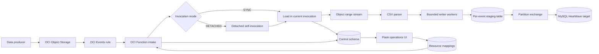

The Resource Mapping is the runtime contract. It associates a compartment, bucket, and object-name pattern with a target database and table, and records operational settings such as:

| Mapping field | Purpose |
| --- | --- |
| `invocation_mode` | Selects `SYNC` or `DETACHED` dynamically. |
| `worker_threads` | Selects the number of concurrent MySQL writers for that mapping. |
| `timeout_seconds` | Records the intended processing budget for operations and the UI. It does not, by itself, change the OCI Function resource timeout. |
| `resource_name_pattern` | Limits the mapping to the intended Object Storage prefix and filename pattern. |
| `target_database`, `target_table` | Defines the governed MySQL destination. |

The same deployed Function image handles both modes. A mapping change affects new events without rebuilding the container image.

## Why the obvious loading approaches become difficult

### `LOAD DATA` does not read an Object Storage object directly

`LOAD DATA LOCAL INFILE` is fast when a file is available to the client process. An OCI Object Storage object is not a local file path. A Function that uses this approach normally has to:

1. download the object into `/tmp`;
2. open the local copy;
3. send the file to MySQL through `LOAD DATA LOCAL INFILE`;
4. delete the copy.

That creates two large data-transfer steps in the Function: Object Storage to local storage, and local storage to MySQL. It also introduces file allocation, cleanup, and recovery work.

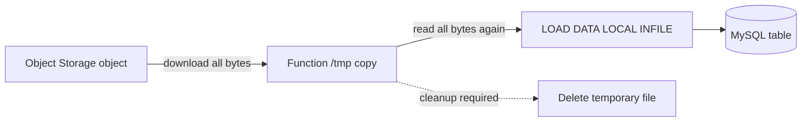

OCI Functions can write only to `/tmp`, and its maximum capacity is tied to the Function memory setting. For example, Oracle documents a maximum `/tmp` size of 256 MB at 1,024 MB Function memory, 512 MB at 2,048 MB memory, and 768 MB at the maximum 3,072 MB memory setting. Successive invocations can also encounter files left by an earlier invocation, so application cleanup is required. See [Accessing File Systems from Running Functions](https://docs.oracle.com/en-us/iaas/Content/Functions/Tasks/functionsaccessinglocalfilesystem.htm).

This explains why assigning more Function memory is not a scalable answer for a 1 GB object: even the documented maximum `/tmp` capacity is smaller than the file, and concurrent invocations need isolated capacity.

### MySQL Shell can read Object Storage, but it is process integration

MySQL Shell import utilities can work with Object Storage. That avoids writing the application's own download implementation, but the Shell is not a direct in-process API for this Flask and OCI Function design. The application has to start and supervise a complete external process, supply credentials securely, capture exit status and logs, enforce timeouts, and reconcile the process result with the event audit. It can be a good managed batch option, but it is a different operational model.

### The UI import is intentionally the simple path

The Flask UI provides a reviewed Data Import workflow:

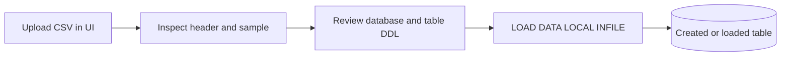

It is appropriate for interactive, controlled files and table creation. In the current implementation the upload limit is 25 MB. The UI keeps the CSV temporarily on the UI server while the review job is active, generates reviewed SQL, and uses `LOAD DATA LOCAL INFILE`. It is not the large Object Storage ingestion path and should not be presented as a 1 GB solution.

## The observed synchronous timeout

OCI Functions has separate Sync and Detached execution timeout settings. The synchronous timeout has a maximum value of 300 seconds. The measured 1 GB Sync test ran for approximately 300.953 seconds and ended with a timeout. Increasing the MySQL shape and using 16 writer threads did not create enough headroom for that file.

The initial comparison also showed why performance must be measured rather than assumed:

| File | Mode | MySQL shape | Writers | Function result |
| --- | --- | --- | ---: | --- |
| 500 MB | Sync | MySQL.2 | 4 | 240.172 seconds, success |
| 500 MB | Sync | MySQL.8 | 4 | 180.683 seconds, success |
| 500 MB | Sync | MySQL.8 | 16 | 143.708 seconds, success |
| 1 GB | Sync | MySQL.8 | 16 | 300.953 seconds, timeout |

MySQL.2 had 16 GB of memory. MySQL.8 provided more compute capacity, and increasing writers improved the 500 MB result, but the larger shape did not remove every bottleneck. The tested database storage had a 50 GB allocation, one LUN, and a maximum of approximately 3,750 IOPS. During a 500 MB run the database write-operation metric rose sharply at the ingestion peak while MySQL.8 CPU remained around 30 percent. That combination is evidence of a storage-bound phase: adding CPU or threads cannot make a single constrained volume accept writes indefinitely faster.

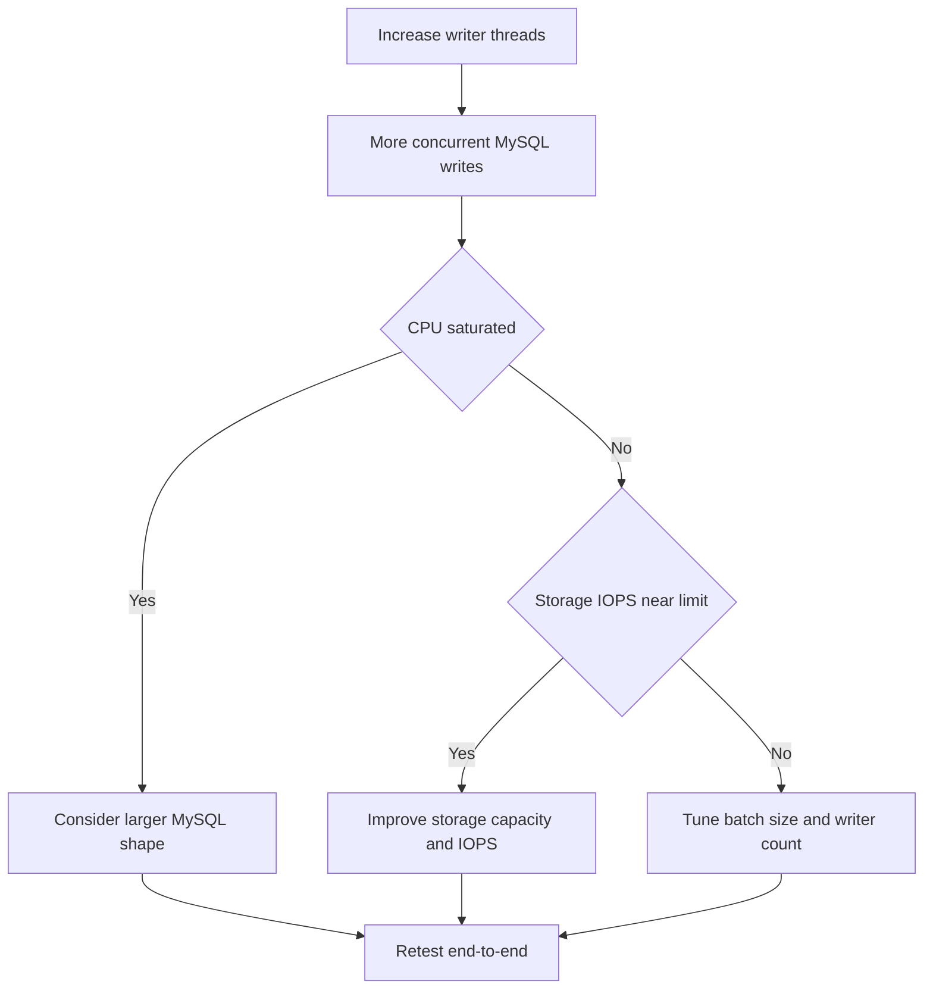

Worker threads should therefore be treated as a measured setting, not a universal accelerator. More writers mean more Connector/Python connections, more concurrent commits, and more pressure on database storage. A configuration that improves MySQL.8 can overload a smaller shape or a low-IOPS volume.

## Diskless Object Storage streaming

The large-file path avoids the local CSV copy. `ObjectStorageRangeStream` implements a seek-free `io.RawIOBase` reader:

1. `HEAD` obtains the object length;
2. sequential `GET` requests read bounded byte ranges;
3. `BufferedReader` bridges range boundaries;
4. `TextIOWrapper` decodes UTF-8 incrementally;
5. `csv.DictReader` validates the header and yields rows;
6. bounded row batches are submitted to writer threads;
7. each writer inserts into the same per-event staging table with its own database connection.

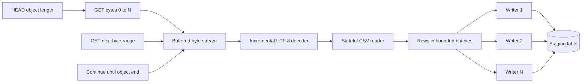

The default range is 32 MiB. A range boundary can occur inside a CSV row, quoted field, or multibyte UTF-8 character. The buffered byte and text layers preserve parser state, so the application must not split ranges into independent CSV parsers.

The parser is intentionally single-threaded because CSV quoting state is sequential. Parallelism begins after rows have been parsed. The loader limits pending jobs to roughly twice the writer count. With four writers and `BATCH_ROWS=10000`, no more than about eight batches are awaiting completion, in addition to the current parser and range buffers.

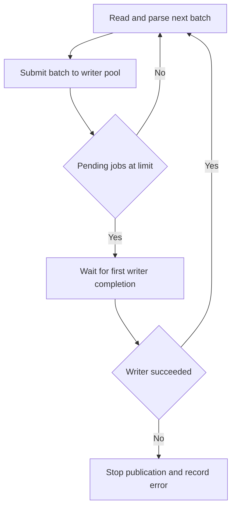

This architecture removes the full temporary file and the duplicated local-file read. It does not remove the need for memory planning: parsed Python strings, queued row tuples, connector buffers, and worker activity still use memory. Wide rows may require a smaller batch size even when the raw range is only 32 MiB.

## Staging tables and atomic publication

Each create or update event receives an isolated staging table. The loader validates the target table, allocates or reuses the source object's batch identity, ensures the target partition exists, and creates the staging table with `CREATE TABLE ... LIKE` followed by removal of partitioning.

Workers insert only into staging. After every writer succeeds, the Function validates the batch and exchanges the stage table with the target partition:

```sql
ALTER TABLE target_table
  EXCHANGE PARTITION p_<batch_num>
  WITH TABLE target_table_stage_<unique_id>
  WITHOUT VALIDATION;
```

Partition exchange is the publication boundary. Readers see the prior partition or the completed replacement, rather than a partially loaded file.

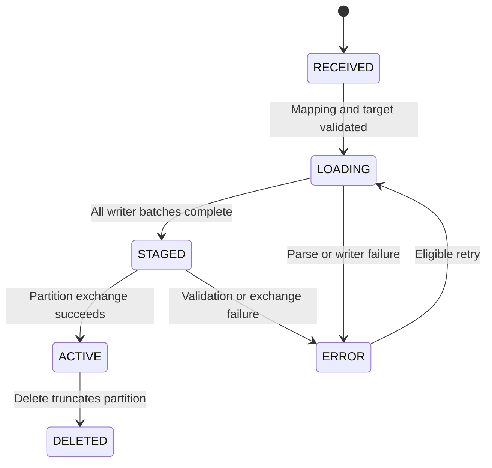

### Why staging tables can become orphaned

The code attempts `DROP TABLE IF EXISTS` in a `finally` block on success and failure. A staging table can still remain when:

- OCI terminates the Function at its timeout before Python reaches `finally`;
- the container is stopped;
- the database connection is unavailable during cleanup;
- the exchange or cleanup statement fails;
- an operator interrupts processing.

The UI's Registered Table view lists staging tables associated with each target, and provides Cleanup and Clean all actions. Cleanup is disabled while the target has a `LOADING` batch because a table may belong to an active invocation. Before forced cleanup, confirm that the Function is no longer running and that the lease is stale.

Recommended production improvement: store the staging table name and lease owner in the control schema as soon as the table is created. A scheduled reaper can then remove only tables whose lease is expired and whose Function invocation is terminal.

## Sync and Detached processing

### Sync mode

Sync mode performs mapping resolution and ingestion in the Event Rule invocation. It is simple and provides an immediate HTTP result, but the complete load, validation, exchange, and cleanup must fit within 300 seconds.

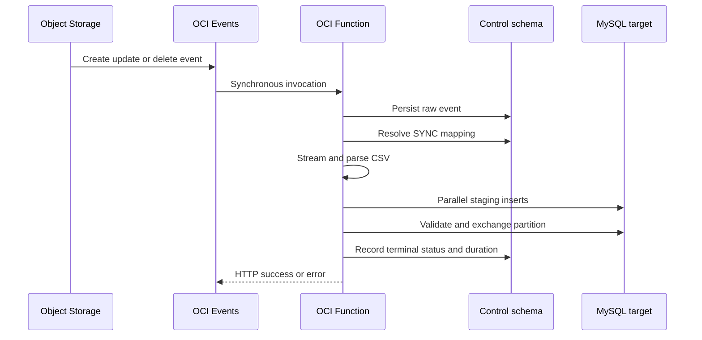

Use Sync when representative files finish with comfortable margin. Do not select it merely because the current sample is small. Include Event delivery latency, Function cold start, streaming, database writes, validation, exchange, audit, and cleanup in the budget.

### Detached mode

Detached mode separates event intake from long-running execution. The Event Rule still invokes the Function. The intake invocation writes the raw event, resolves a `DETACHED` mapping, and invokes the same Function with `fn_invoke_type="detached"`. The worker payload includes `_detached_worker=true` and the original `object_event_id`, allowing the worker to continue the same audit chain.

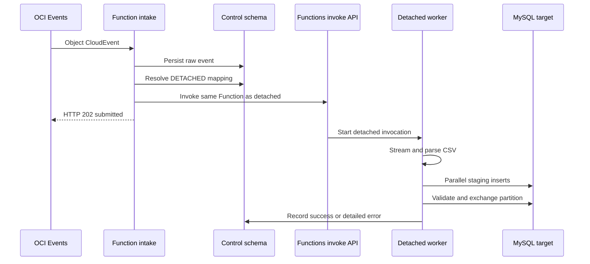

Oracle currently supports a Detached invocation timeout from 5 to 3,600 seconds. If `detachedModeTimeoutInSeconds` is not configured on the Function resource, Detached mode falls back to the synchronous `timeoutInSeconds` value. See [Changing Default Memory and Timeout Settings](https://docs.oracle.com/en-us/iaas/Content/Functions/Tasks/functionscustomizing.htm) and [Invoking Functions](https://docs.oracle.com/en-us/iaas/Content/Functions/Tasks/functionsinvokingfunctions.htm).

This distinction matters in the current deployment:

- `DETACHED_TIMEOUT_SECONDS=3600` is injected as application configuration;
- the UI records timeout metadata up to 3,600 seconds;
- neither setting changes the OCI Function resource by itself;
- deployment must also set `detachedModeTimeoutInSeconds`.

For example, after resolving the Function OCID:

```bash
oci fn function update \
  --function-id "$FUNCTION_ID" \
  --detached-mode-timeout-in-seconds 3600 \
  --force
```

Detached invocation returns control quickly and supports the longer configured execution time. It is not a durable queue, does not automatically retry application failures, and does not guarantee event order. For stronger delivery and retry semantics, place OCI Queue or Streaming between intake and worker processing, and configure detached success and failure destinations where appropriate.

## Dynamic Function identity during deployment

Detached self-invocation requires two values that should never be hard-coded:

- the Function OCID in `FUNCTION_ID`;
- the regional invoke endpoint in `FUNCTION_INVOKE_ENDPOINT`.

The deployment creates or updates the Function, then discovers both values:

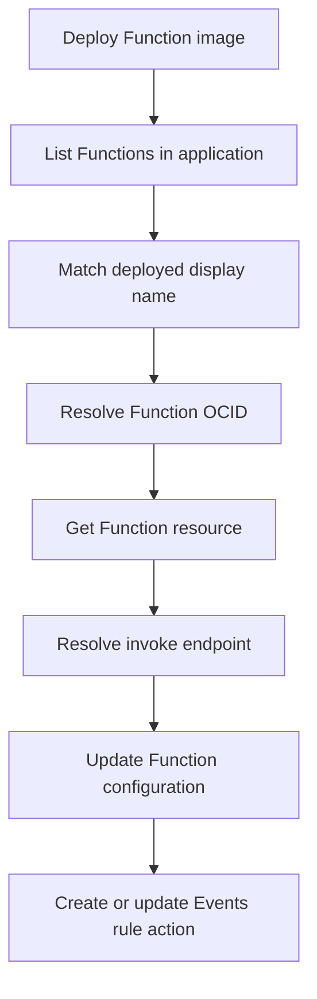

Conceptually, the deployment performs:

```bash
FUNCTION_ID=$(oci fn function list \
  --application-id "$APP_ID" \
  --all \
  --query "data[?\"display-name\"=='$FUNCTION_NAME'].id | [0]" \
  --raw-output)

FUNCTION_INVOKE_ENDPOINT=$(oci fn function get \
  --function-id "$FUNCTION_ID" \
  --query 'data."invoke-endpoint"' \
  --raw-output)
```

The Function uses a resource-principal signer to call the Functions invoke API. The Function must belong to a Dynamic Group, and IAM policy must allow that Function resource principal to invoke the intended Function. Instance-principal permission on the deployment VM is not enough for runtime self-invocation.

The deployment should fail if the OCID or invoke endpoint cannot be resolved. It should also apply both timeout properties explicitly:

| OCI Function property | Recommended setting |
| --- | --- |
| `timeoutInSeconds` | Sync budget, maximum 300 seconds. |
| `detachedModeTimeoutInSeconds` | Detached budget, maximum 3,600 seconds. |
| Memory | Sized for runtime and bounded parser/writer buffers, not as a substitute for object storage. |

## Audit, timing, and actionable errors

The control schema is the operational source of truth:

| Record | Evidence |
| --- | --- |
| `object_event` | Raw Object Storage event, event ID, event type, object identity, receive time, completion time, and duration. |
| `event_tx_log` | Mapping, target, batch, action, terminal status, object version, and operator-facing message. |
| `event_errors` | Error code, error message, target context, action, and link to the transaction. |
| `source_object_batches` | Object-to-batch identity and lifecycle state such as `LOADING`, `ACTIVE`, `ERROR`, or `DELETED`. |
| `target_batch_sequences` | Per-target allocation of batch numbers. |

The UI displays durations in seconds even though the database can retain millisecond precision. Keep these timestamps distinct:

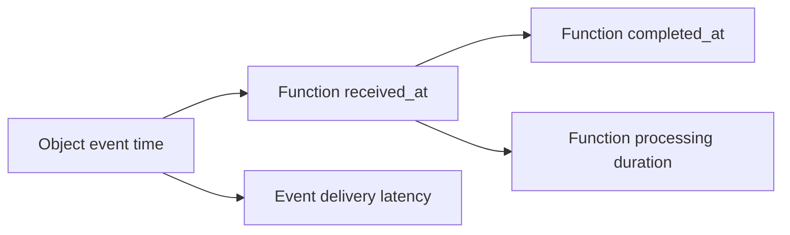

An error message should identify the failed phase and preserve safe context. Useful examples include:

- `No Resource Mappings entry matches this compartment, bucket, and resource name.`
- `CSV columns do not match target table (missing: ... unknown: ...).`
- `Incorrect datetime value ... for column event_ts at row ...`
- `This source object already has a load in progress.`
- `Mapping requests DETACHED mode but FUNCTION_ID is missing.`
- `Mapping requests DETACHED mode but FUNCTION_INVOKE_ENDPOINT is missing.`
- `No space left on device` for the obsolete local-download design;
- `FunctionInvokeTimeout` or HTTP 504 when the execution budget is exceeded.

Do not log database passwords, OCIR tokens, SSH keys, full sensitive row values, or signed URLs. OCI Functions invocation logs complement the control database, but a terminal control record is necessary because a detached caller receives only submission acknowledgement rather than the final worker result.

One current limitation is that a secondary audit-write failure can be suppressed while handling the original exception. Production hardening should send an independent structured error to OCI Logging and, where possible, a detached failure destination so an audit database outage does not make a failed event invisible.

## Troubleshooting the event flow

Troubleshoot from the event edge toward the database, preserving the same bucket, object name, event ID, and mapping ID at every step.

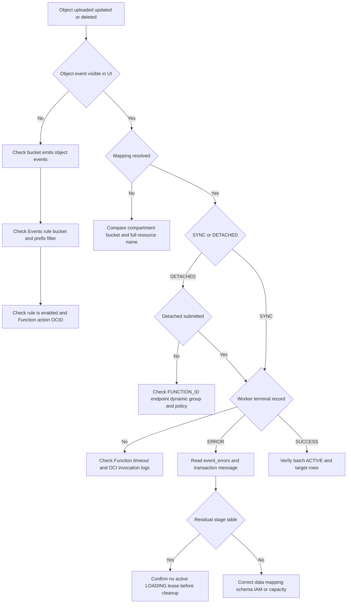

### Practical diagnostic checklist

1. Confirm Object Storage emitted the event and note its `eventID`, `eventType`, bucket, and full `resourceName`.
2. Compare the Events rule condition with the actual prefix. Historical folders and a new test prefix frequently fail to match.
3. Confirm the rule action references the current Function OCID, especially after recreating a Function.
4. Check `object_event`. If no row exists, focus on bucket events, rule filtering, rule state, action OCID, and Function invocation logs.
5. If the raw event exists but no mapping is found, compare compartment name, bucket name, and the full resource-name pattern.
6. For Detached mode, verify `DETACHED_ENABLED`, `FUNCTION_ID`, `FUNCTION_INVOKE_ENDPOINT`, resource-principal policy, and the actual `detachedModeTimeoutInSeconds` property.
7. Check `event_tx_log`, `event_errors`, and the batch lifecycle state.
8. Compare CSV headers case-insensitively with the target's loadable columns. Validate MySQL date formats before a large run.
9. Check Function duration, memory, range-read behavior, writer failures, MySQL connections, CPU, storage IOPS, and free database storage.
10. If a staging table remains, do not drop it until the relevant invocation and lease are terminal.

## Solving large-file import

There is no single best path for every file.

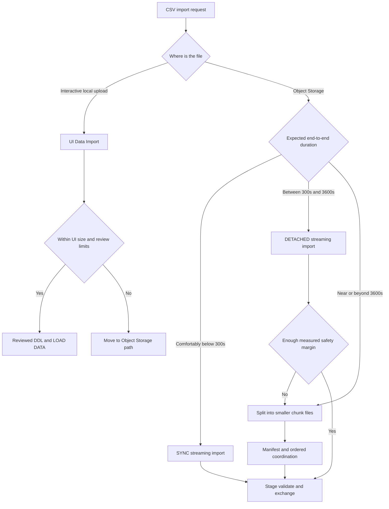

### Option 1: UI Data Import

Use the UI for a small, interactive file where an operator wants to inspect the CSV, edit the proposed schema, create the table, and run `LOAD DATA LOCAL INFILE`. It is the simplest operational path, but the current 25 MB UI limit and local temporary handling make it unsuitable for large Object Storage objects.

### Option 2: Detached streaming import

Use Detached mode when the file exceeds the safe Sync budget but reliably finishes within the configured Detached limit. Configure `detachedModeTimeoutInSeconds` on the Function resource, retain generous margin below 3,600 seconds, use diskless range streaming, and monitor the worker's terminal audit record.

### Option 3: Split the logical file

Split very large input into smaller independent CSV objects when a single file approaches the Detached limit, when retry cost is too high, or when the producer can naturally partition data. A manifest should record:

- logical dataset and generation ID;
- ordered chunk number and total chunk count;
- object name and version or ETag;
- expected row count and checksum;
- target table and partition key;
- allowed lifecycle operation;
- publication status.

Do not declare the logical dataset complete until every required chunk succeeds. Decide whether each chunk is independently visible or whether a coordinator must perform a final publication step.

## File order is not processing order

Object Storage object names and upload order do not create an execution-order guarantee. OCI Events can deliver independently, Function invocations can start concurrently, and different file sizes can complete in a different order.

This is true for both modes:

| Mode | Ordering behavior |
| --- | --- |
| Sync | The caller waits for each invocation, but separate Object Storage events can still invoke Functions concurrently. There is no global FIFO or per-table serial queue. |
| Detached | Intake submissions return quickly and workers run independently. Submission order does not guarantee start order or completion order. |

The current code has a per-source-object `LOADING` lease and a per-target batch-number allocator. These protect some concurrency conditions, but they do not serialize all files mapped to one target table and they do not make a set of files one transaction.

### Delete and create ordering hazard

Suppose a record must move from `chunk-001.csv` to `chunk-002.csv`. The design does not support the same logical record appearing in both files. If the new file is processed before the old file's deletion completes, the load can encounter a duplicate key or expose duplicate logical data.

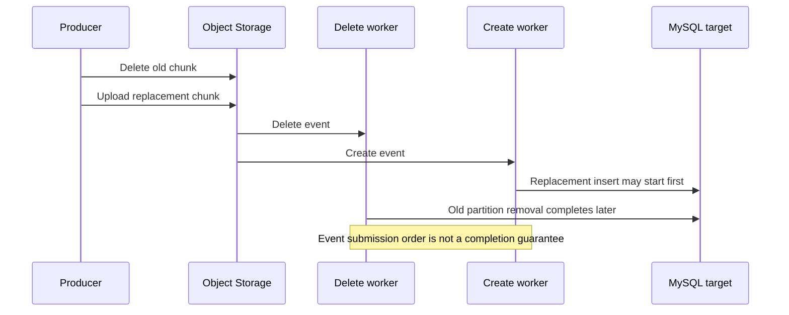

Safe operating rule: complete and verify the removal first, then upload the replacement. For automation, use a durable queue with a partition key such as target table plus logical record set, a persisted monotonically increasing sequence, and one active worker per key. Reject or defer an event whose predecessor has not reached `SUCCESS`.

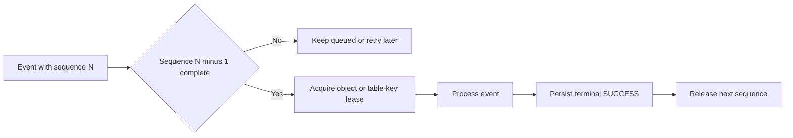

File names such as `part-0001.csv` can document intended order, but lexical naming alone cannot enforce it.

## Limitations and assumptions

The architecture is intentionally explicit about its transaction boundary.

1. A table can map to multiple CSV files, but each file represents a distinct partition of the table's data.
2. Duplicate logical records across different files are not supported.
3. Atomicity is per file and per partition exchange. A collection of files is not one MySQL transaction.
4. Moving records between files requires ordered removal followed by creation, or a coordinated manifest transaction outside the current event handler.
5. Sync execution must finish within 300 seconds and should retain safety margin.
6. Detached execution can run for up to 3,600 seconds only after the Function resource property is configured. Detached mode is asynchronous, not a durable queue.
7. A 3,600-second limit still makes some files too large. Split them or use a longer-running managed ETL or container worker.
8. The CSV header must match the target's loadable columns. Schema evolution is not inferred automatically.
9. Every unique key on the partitioned target must include the loader-owned `batch_num` column.
10. Partition exchange requires target and staging structures to be compatible.
11. The parser supports streaming but remains sequential; writer parallelism begins after parsing.
12. More writers require more MySQL connections and can saturate IOPS before CPU.
13. Function termination can leave a stage table and a stale `LOADING` lease. Cleanup must be lease-aware.
14. Object create, update, and delete events can be retried, duplicated, or processed concurrently. Idempotency must use the event ID and object version or ETag.
15. The current UI Detached Processes page is primarily monitoring. Retry and cleanup of detached work require a durable queue and lease-aware service endpoints before the actions can be safely enabled.
16. Database credentials and deployment secrets must remain in protected server-side configuration or a secret service, never in mapping rows, browser state, event payloads, or logs.

## Operational excellence through the UI

The Flask UI turns the ingestion code into an operable service rather than a hidden Function:

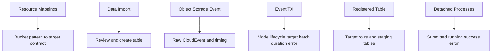

From an operator's perspective, the ideal flow is:

1. use Data Import to inspect a representative small CSV and create a reviewed target table;
2. confirm partitioning, keys, column types, and the invisible `batch_num` design;
3. register an Object Storage mapping and choose Sync or Detached mode;
4. set an evidence-based writer count and timeout;
5. verify the Events rule prefix and Function action;
6. observe the raw event, execution mode, lifecycle, duration in seconds, batch, and error details;
7. inspect residual staging tables and clean them only when processing is terminal;
8. use the Detached Processes view for long-running work and correlate it with the original event.

The UI should never imply that a mapping's `timeout_seconds` value changed the OCI Function resource. Display both the requested mapping budget and the effective Function Sync and Detached timeout properties so operators can detect configuration drift.

## Recommended production evolution

The current design is effective for bounded file ingestion, but the reliable large-file target architecture adds durable orchestration:

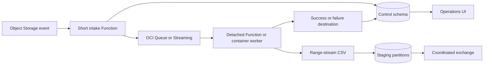

The queue provides retry, back-pressure, and ordering keys. A detached Function is suitable for work within one hour. For workloads that can exceed one hour, require very high database throughput, or need sophisticated multi-file transactions, use a longer-running container, OCI Data Integration, or another managed job platform while retaining the same mapping, audit, staging, and publication contract.

## Closing perspective

The key architectural shift is to stop treating a CSV as merely a file to copy into a table. It is a versioned data partition with a lifecycle, execution budget, transaction boundary, and audit identity.

Diskless range streaming removes the Function file-capacity failure and duplicate local I/O. Writer threads and larger MySQL shapes can improve performance, but only while database connections, CPU, storage throughput, and IOPS have headroom. Partition exchange makes a completed file visible atomically. Sync and Detached mappings make the execution path dynamic, while the UI connects table creation, mapping, evidence, troubleshooting, and cleanup.

For large data, the operating principle is simple: use Sync only with measured margin, configure Detached correctly for work under one hour, and split or move to durable long-running orchestration when a single file no longer fits the platform boundary.
