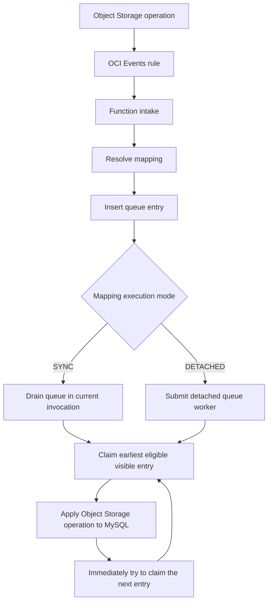
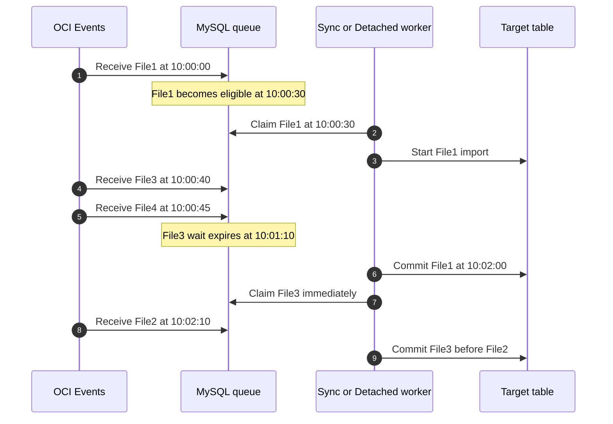
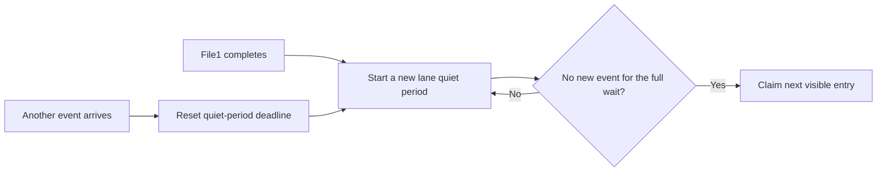
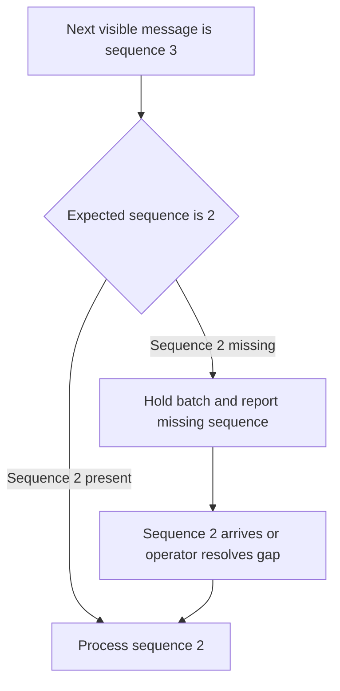
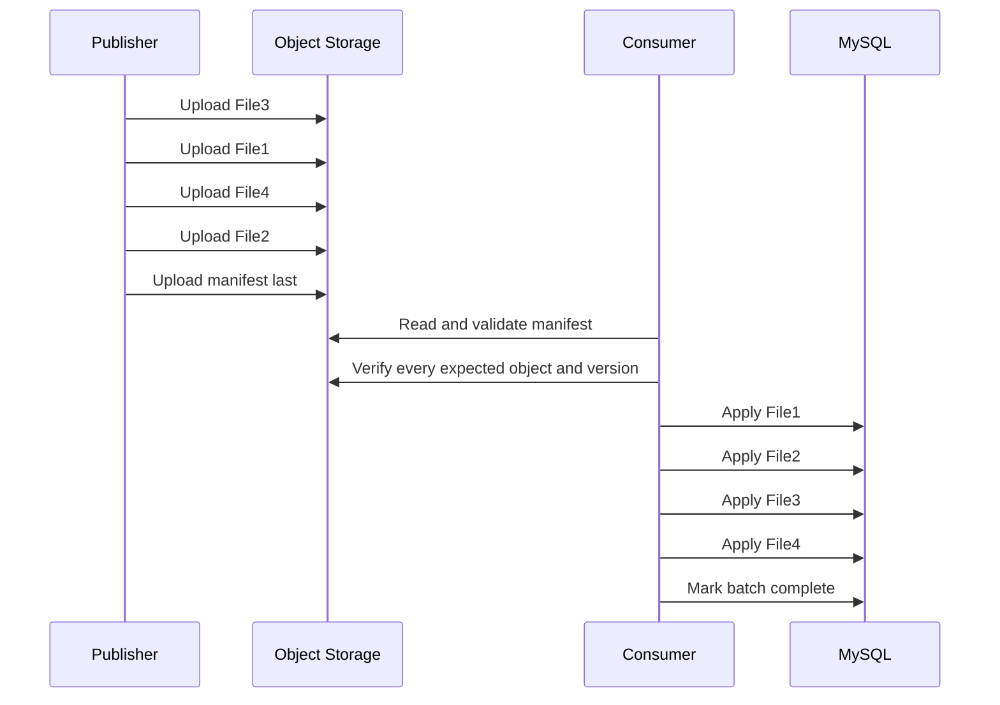
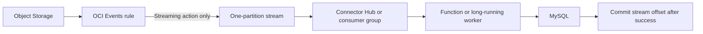

# Object event ordering problem and resolution alternatives

## Executive finding

The current queue serializes events that are already visible in one queue
binding, but it cannot know that an earlier event has not arrived yet. This is
an ordering limitation for both Sync and Detached mappings.

- Sync inserts the event into the queue and drains the lane in the current
  Function invocation.
- Detached inserts the event into the same queue and submits a detached worker
  to drain the lane.
- Both modes use the same claim query, completion watermark, and per-entry
  reorder-grace calculation.

Consequently, changing from Detached to Sync does not resolve late or reordered
Object Storage event delivery. Execution mode controls the worker transport and
runtime budget. It does not provide a stronger source-order guarantee.

## Current processing flow



The queue orders currently visible entries by:

```text
event_time, received_at, priority, queue_id
```

The mapping wait is evaluated against the individual entry:

```text
current time >= entry.received_at + mapping wait
```

It is not evaluated as a new quiet period after the previous file completes.
The worker therefore may claim an already-aged entry immediately after a long
file finishes.

## Example of the ordering failure

Assume a publisher intends this business order:

```text
File1 → File2 → File3 → File4
```

OCI Events and independent Function intake invocations can expose the queue in
this order:

```text
File1 → File3 → File4 → File2
```

The following example uses a 30-second mapping wait.



At 10:02:00, File3 has already waited longer than 30 seconds. The worker does
not start another 30-second observation window, so File3 is eligible
immediately even though File2 has not arrived.

Two outcomes are possible when File2 finally arrives:

1. If File2 has an event timestamp older than the completed File3 watermark,
   the queue blocks it as a late event. This detects the conflict but does not
   undo File3.
2. If File2 has a later timestamp because its upload completed later, it can be
   processed after File3 without being classified as late. The queue has no
   knowledge that the filename implies a different business sequence.

The 30-second wait is therefore a bounded reordering grace period, not an order
guarantee.

## Why a queue or stream alone cannot infer missing work

A consumer can order only messages that have arrived. It cannot distinguish
between these states without an external contract:

- File2 is delayed and will arrive later.
- File2 failed to upload and will never arrive.
- File2 does not belong to this batch.
- File3 is intentionally the next operation.

OCI Streaming guarantees the order in which messages were produced within one
partition. It does not reconstruct a producer's intended file order when OCI
Events publishes File3 before File2. Messages across different stream
partitions also do not have a global ordering guarantee. See
[OCI Streaming partition ordering](https://docs.oracle.com/en-us/iaas/Content/Streaming/Concepts/partitioningastream.htm)
and the
[OCI Streaming overview](https://docs.oracle.com/en-us/iaas/Content/Streaming/Concepts/streamingoverview.htm).

## Alternative 1: lane quiet period after every enqueue and completion

This is the smallest improvement to the existing MySQL queue.

Add these lane timestamps:

```text
last_enqueued_at
last_completed_at
next_claim_not_before
```

Every enqueue recalculates the claim barrier. Every completion starts another
full wait period:

```text
next claim time = max(
    last_enqueued_at + mapping wait,
    last_completed_at + mapping wait
)
```



Advantages:

- Directly prevents the worker from immediately claiming File3 after File1.
- Requires limited schema and worker changes.
- Works for both Sync and Detached queue workers.

Limitations:

- It is still best effort. File2 can arrive after the quiet period.
- Larger waits increase end-to-end latency for every file.
- There is no way to determine whether a missing file will ever arrive.

## Alternative 2: strict batch sequence

Require every operation to carry an explicit batch identifier and sequence
number, for example:

```text
employees/batch-20260720/file-0001.csv
employees/batch-20260720/file-0002.csv
employees/batch-20260720/file-0003.csv
employees/batch-20260720/file-0004.csv
```

Persist `batch_id` and `sequence_number` on each queue or stream message. The
consumer processes only the expected next sequence. If sequence 2 is absent,
sequence 3 remains waiting even if its grace period has expired.



Advantages:

- Prevents File3 from executing before File2.
- Makes missing files visible and actionable.
- Can work with either the MySQL queue or OCI Streaming.

Limitations:

- The producer must generate reliable batch and sequence metadata.
- The system needs an operator policy for a permanently missing sequence.
- A final sequence or expected count is needed to know when the batch is
  complete.

## Alternative 3: batch manifest or READY marker

This is the recommended approach when batch order is a business requirement.
Upload all data files first, then publish a manifest or READY object last.

```json
{
  "batchId": "employees-20260720-001",
  "operations": [
    {"sequence": 1, "object": "file1.csv", "action": "CREATE"},
    {"sequence": 2, "object": "file2.csv", "action": "CREATE"},
    {"sequence": 3, "object": "file3.csv", "action": "CREATE"},
    {"sequence": 4, "object": "file4.csv", "action": "CREATE"}
  ]
}
```



The consumer must not process the batch until:

- the manifest or READY marker exists;
- every listed object exists;
- expected versions, sizes, or checksums match; and
- every sequence number is present exactly once.

Advantages:

- Provides an explicit batch-completion barrier.
- Guarantees the intended order rather than guessing from delivery time.
- Supports create, update, and delete operations in one declared sequence.
- Enables complete-batch validation before the first target mutation.

Limitations:

- Requires a producer-side publication protocol.
- Multiple files are still not one MySQL transaction unless a separate
  database design provides batch-wide atomicity.
- Failed batches need retry, cancellation, and retention procedures.

## Alternative 4: OCI Streaming as the durable work log

OCI Events rules can deliver events to a stream or a Function. Do not configure
both as parallel processing actions for the same mapping. Those actions are
independent, so the direct Function action would race with the stream consumer.
See [adding OCI Events actions](https://docs.oracle.com/en-us/iaas/Content/Events/Task/create-action-events-rule.htm).

Use one processing path:



For files that reliably complete within the 300-second synchronous Function
limit, Connector Hub can use Streaming as its source and a Function as its
target. Configure one-message batches when each event represents one file. See
[creating a Connector Hub Streaming source](https://docs.oracle.com/en-us/iaas/Content/service-connector-hub/create-service-connector-streaming-source.htm).

For files that may exceed the Function limit, use a long-running consumer on
Compute or OKE. It can process one message and commit its consumer-group offset
only after MySQL commits. Consumer groups coordinate partition ownership and
track committed offsets. See
[OCI Streaming consumer groups](https://docs.oracle.com/en-us/iaas/Content/Streaming/Tasks/using_consumer_groups.htm).

Streaming can replace the MySQL work queue when all of these are true:

- stream offset order is the required processing order;
- one partition is used for each strict ordering boundary;
- only one consumer-group member owns that partition;
- processing is idempotent because delivery is at least once; and
- the consumer commits only after the target operation succeeds.

Streaming alone does not solve File3 arriving before File2. Combine it with a
manifest or strict sequence when business order differs from stream append
order. Stream records are not deleted immediately after processing; consumers
advance committed offsets, and records remain until retention expires.

## Comparison

| Alternative | Prevents immediate next claim | Detects a missing file | Guarantees business order | Supports files over 300 seconds | Removes MySQL queue |
| --- | --- | --- | --- | --- | --- |
| Existing per-entry grace | No | No | No | Detached only | No |
| Lane quiet period | Yes | No | No | Yes with Detached | No |
| Strict sequence | Yes | Yes | Yes, with correct producer metadata | Yes | Optional |
| Manifest or READY marker | Yes | Yes | Yes | Yes | Optional |
| Streaming and synchronous Function | Serializes stream offsets | No | Only stream append order | No | Yes |
| Streaming and long-running consumer | Serializes stream offsets | No | Only stream append order | Yes | Yes |
| Streaming plus manifest | Yes | Yes | Yes | Depends on consumer runtime | Yes |

## Recommended implementation path

1. Rename the UI description from an ordering guarantee to **reordering grace**.
2. Add a lane quiet period after every enqueue and completion as an immediate
   best-effort safety improvement.
3. Add mapping policies such as `NONE`, `QUIET_WINDOW`, `STRICT_SEQUENCE`, and
   `MANIFEST` instead of relying only on an order-important boolean.
4. For strict mappings, add `batch_id`, `sequence_number`, `expected_count`, and
   `batch_state` to the control model and Queue UI.
5. Add UI views for incomplete batches, missing sequences, manifest validation,
   retry, cancel, and an audited operator override.
6. If replacing the MySQL queue, create a single OCI Events Streaming action
   and a one-partition-per-ordering-domain consumption design.
7. Use Connector Hub and a synchronous Function only for work safely below 300
   seconds. Use a long-running consumer for larger files.
8. Retain idempotent target mutations and event identifiers in every design.

## Assumptions and limitations

- OCI Events and downstream consumers use at-least-once delivery, so duplicate
  processing must remain safe.
- A filename has no ordering meaning unless the producer and mapping explicitly
  define it as part of the contract.
- A wait duration reduces the probability of reordering but cannot prove that
  a batch is complete.
- One stream partition limits parallelism for that ordering domain.
- Multiple stream partitions provide only partition-local order.
- Neither a MySQL queue nor OCI Streaming makes multiple file mutations one
  database transaction.
- A delete that removes an object before its earlier create/update consumer has
  read the content can make that earlier operation impossible to complete.
- Strict ordering ultimately requires producer-supplied sequence or
  batch-completion information.
