# Ordered Object Storage event queue design

This document describes the implemented MySQL-backed queue used to serialize
OCI Object Storage create, update, and delete events before they mutate mapped
HeatWave MySQL tables. It covers the OCI Function workflow, queue ownership and
ordering rules, Sync and Detached processing, the Flask operations UI,
operational recovery, known limitations, and the available performance and
workflow validation evidence.

## Why a queue is required

OCI Events delivery is at-least-once. Separate Function invocations may overlap,
be retried, or arrive in an order that is different from the producer's
business operation order. This matters because a file represents one logical
partition of a target table:

- CREATE loads and publishes a new file partition.
- UPDATE replaces the partition owned by that file.
- DELETE removes that partition.
- A later DELETE must not bypass an earlier CREATE or UPDATE for the same
  ownership boundary.
- Multiple mappings can target the same table, so invocation-level locking is
  not sufficient.

The durable queue converts independent event deliveries into one ordered stream
per target table by default. It does not claim to make multiple files one
database transaction, and it cannot recover object content that a producer has
already deleted.

## Architecture

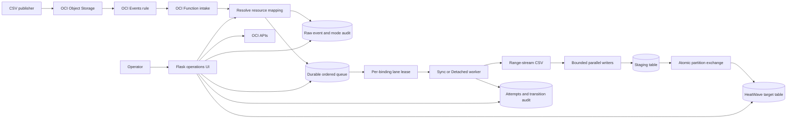

The queue is a control-plane and coordination layer. The existing data plane
still streams CSV data directly from Object Storage into bounded batches and
publishes a completed file with one partition exchange.

## Queue data model

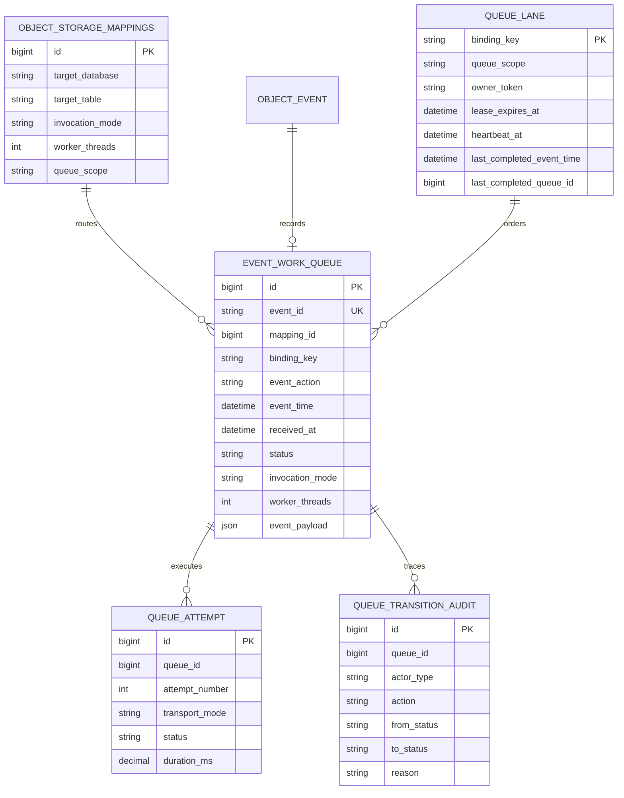

The main responsibilities are:

| Control object | Responsibility |
| --- | --- |
| `object_storage_mappings` | Selects target, requested execution mode, writer count, and queue scope. |
| `queue_lane` | Holds the single worker lease, heartbeat, dispatch flag, and completion watermark for one binding. |
| `event_work_queue` | Stores the immutable event snapshot, ordering fields, requested mode, worker count, state, lease, and error. |
| `queue_attempt` | Records each actual execution attempt, invocation identity, transport mode, duration, and error. |
| `queue_transition_audit` | Records Function, UI, and system state changes with reasons. |
| `object_event` and transaction logs | Preserve raw lifecycle delivery, requested execution mode, timing, target result, and loader errors. |

## Queue binding and concurrency

Each mapping chooses one of two ownership scopes.

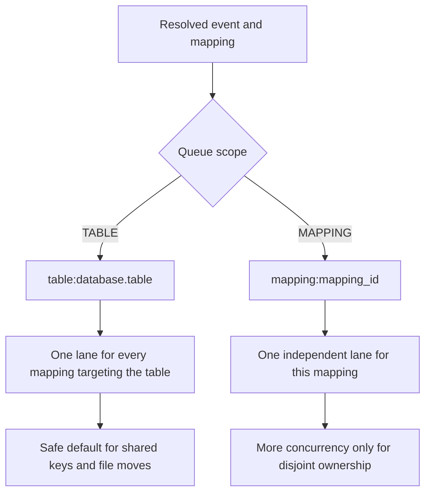

TABLE scope is the safe default. It serializes all mappings that target the
same table. MAPPING scope can increase concurrency, but it is safe only when
the mappings own independent records or partitions and cannot conflict through
unique keys, record moves, or delete/create order.

Queue binding determines ordering, not the Object Storage folder alone. Two
different tables can process concurrently because they have different lanes.

## End-to-end event workflow

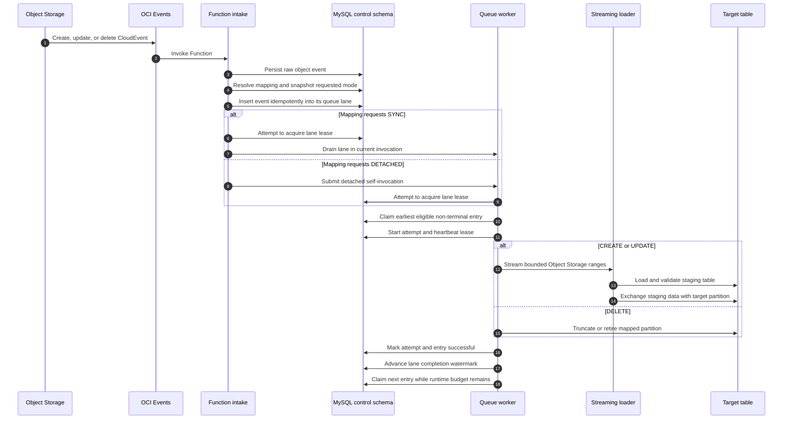

The `event_id` unique key makes queue intake idempotent. A redelivered
CloudEvent resolves to the existing queue entry rather than applying the target
mutation twice.

## Ordering and claim algorithm

Within one binding, the worker selects the first non-terminal entry using:

```text
event_time ASC, received_at ASC, priority ASC, queue_id ASC
```

Priority is therefore a tie-breaker after event and receipt time; it is not a
general mechanism for moving a newer business event ahead of an older one.

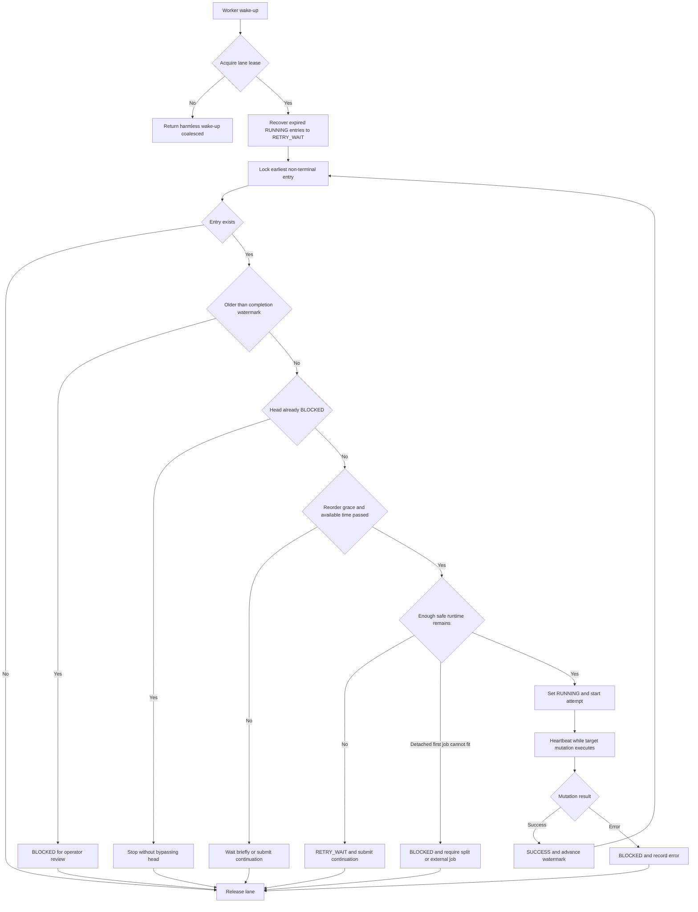

The default 30-second reorder grace allows closely delivered events to settle
before the first mutation starts. It reduces, but cannot eliminate, late-event
risk because the system cannot know that an event which has not arrived yet
exists.

## Lease, heartbeat, and continuation

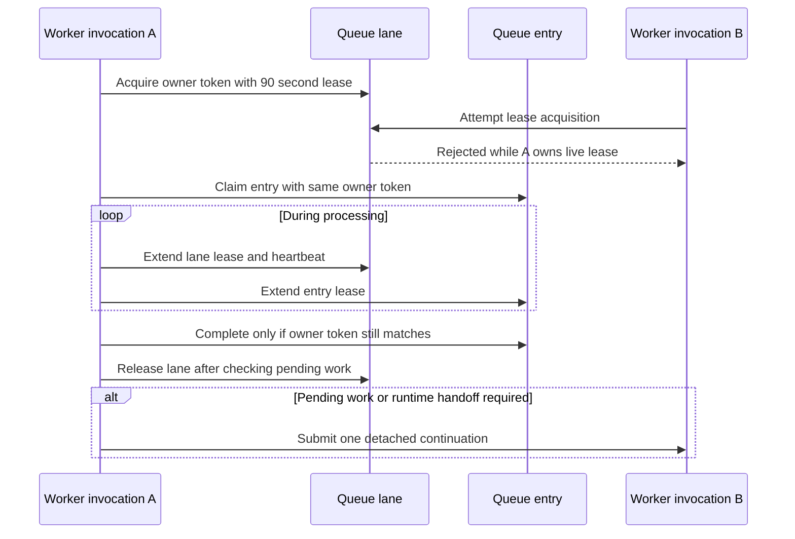

Only one invocation can own a binding. Extra event deliveries or manual wake
requests are safe: they either fail to acquire the live lease or become the
next owner after release. Expired RUNNING work is recovered to `RETRY_WAIT`.
Completion and deferral both verify the owner token, preventing a stale worker
from committing a queue transition after it has lost ownership.

## Queue states

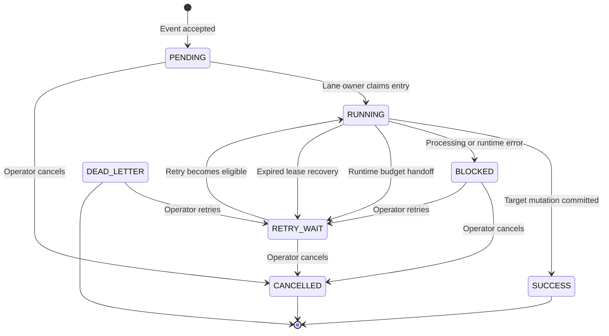

`BLOCKED` is intentionally a lane-stopping state. Later entries remain pending
until an operator retries, cancels, or otherwise resolves the head entry. The
schema retains `LEASED` and `DEAD_LETTER` for operational compatibility and
future policy; the current claim path moves an eligible item directly to
`RUNNING`, and current processing failures move to `BLOCKED`.

## Sync and Detached processing

Requested execution mode is copied from the mapping into the queue entry and
event audit at intake. Actual worker transport is recorded independently in
`queue_attempt`.

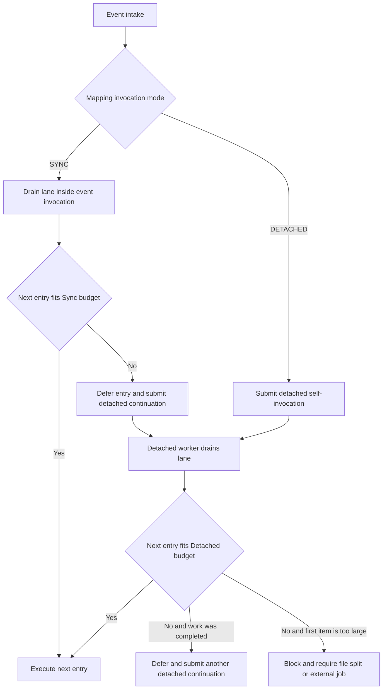

Important distinctions:

- Sync Function execution has a maximum configured runtime of 300 seconds.
- Detached execution can be configured up to 3,600 seconds.
- A queue entry requested as Sync may eventually run through a Detached
  continuation when the original invocation lacks safe remaining time.
- The UI therefore shows both **Requested mode** and **Worker transport**.
- Detached self-invocation requires `DETACHED_ENABLED`, the deployed Function
  OCID, invoke endpoint, region, and Function resource-principal permission to
  invoke the intended Function. Deployment discovers and injects the Function
  identity dynamically.

Runtime admission estimates object duration from object size and expected byte
rate, applies a safety factor, and preserves a shutdown reserve. Unknown-size
jobs and DELETE use a conservative configured duration.

## Streaming and database publication

The queue does not download the full CSV to Function-local storage.

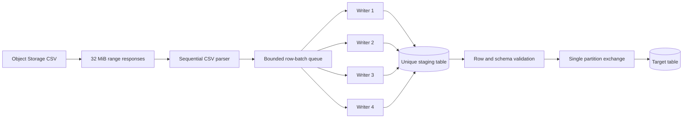

Range streaming avoids a duplicate download/write/read cycle and the
memory-backed temporary-filesystem limit in OCI Functions. Back-pressure bounds
memory while multiple writers use available MySQL throughput. The deployed
defaults are four workers and 10,000 rows per batch, but higher worker counts
help only while connections, CPU, storage throughput, and IOPS have headroom.

Partition exchange provides an atomic publication point for one file. It does
not provide a transaction spanning multiple files or queue bindings.

## Operations UI

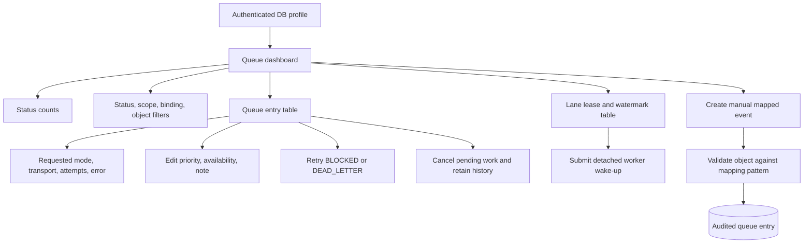

The Queue page provides:

- status counts for pending, running, retry-wait, blocked, successful,
  cancelled, and dead-letter entries;
- filters by status, TABLE or MAPPING scope, binding key, and object name;
- requested execution mode beside actual worker transport and attempt duration;
- lane ownership, lease expiry, heartbeat, pending/running/blocked depth,
  generation, and completion watermark;
- audited manual entry creation using an existing mapping;
- edit for scheduling metadata only on `PENDING`, `RETRY_WAIT`, or `BLOCKED`;
- retry for `BLOCKED` and `DEAD_LETTER` entries;
- cancel for non-running mutable entries while retaining history and audit;
- detached worker wake-up for a selected binding.

The UI does not permit editing the event identity, target, action, mapping,
binding, or event time after enqueue. Those fields define ordering and ownership
and must remain immutable.

### Operational recovery workflow

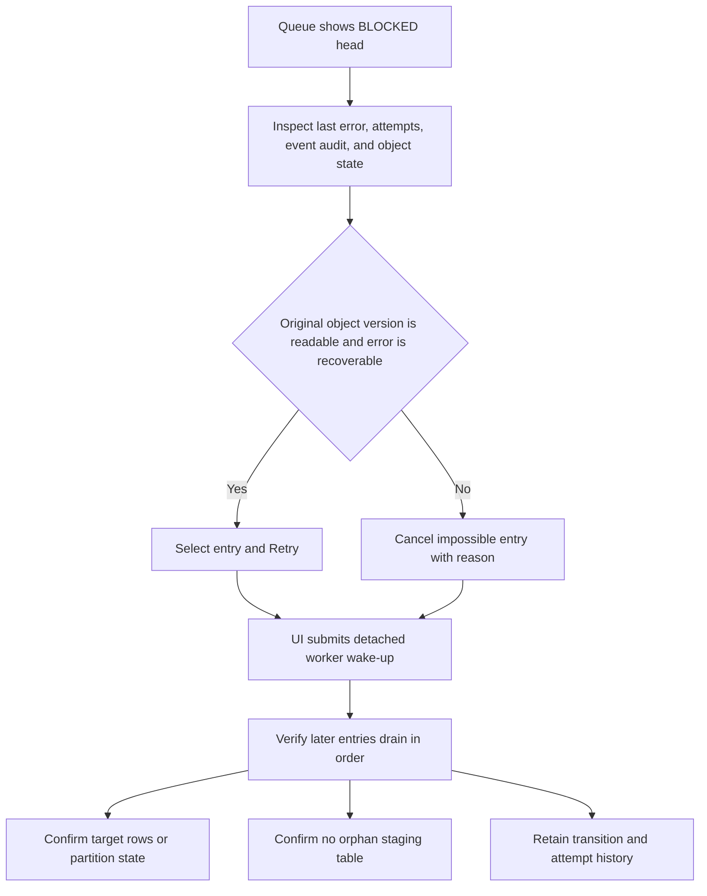

Cancel/delete in the queue UI means cancel the pending work item. It does not
erase the queue row or transition audit.

## Challenges and implemented solutions

| Challenge | Risk | Implemented solution | Remaining constraint |
| --- | --- | --- | --- |
| At-least-once delivery | Duplicate target mutation | Unique `event_id` and idempotent enqueue | Producers still need stable event identities. |
| Overlapping Function invocations | Concurrent mutation of one table | One heartbeated owner lease per TABLE or MAPPING binding | Operations in different bindings are independent. |
| Events delivered close together | Earlier intent may arrive slightly later | Configurable reorder grace and deterministic sort | No grace period can detect an event that has not yet been emitted or delivered. |
| Late event after completed work | Reversing already committed order | Completion watermark blocks older event for review | Operator or producer coordination is required. |
| Failure at the head of a lane | Silent bypass would corrupt order | `BLOCKED` stops the lane; UI retry/cancel and audit | Throughput pauses until resolution. |
| Worker crash or platform interruption | Permanently stuck RUNNING state | Expiring lane/entry leases and automatic recovery to `RETRY_WAIT` | Recovery waits for lease expiry. |
| Invocation timeout | Partial work or repeated timeout | Admission prediction, safety reserve, deferral, detached continuation | A single object that cannot fit 3,600 seconds must be split or moved to an external job. |
| Full local CSV download | Memory-backed filesystem exhaustion and duplicate I/O | Bounded Object Storage range streaming | Parser, range, and row batches still consume bounded memory. |
| Large-file database load | CPU, connection, IOPS, or network bottleneck | Bounded parallel writers and configurable workers/batches | More threads can reduce performance after a resource saturates. |
| Orphan staging table after hard termination | Database clutter and confusing ownership | Unique staging names, normal cleanup, UI individual/Clean all controls | Hard timeout can still require safe operator cleanup. |
| Requested mode confused with actual execution | Incorrect operational reporting | Immutable mode snapshot plus per-attempt transport | Historical rows without reliable snapshots should remain `UNKNOWN`. |
| Producer deletes object before queued UPDATE reads it | Object Storage 404 and lost source version | Block the UPDATE and preserve order; use UI recovery | Queueing cannot recreate deleted content. Use versioning, immutable names, or producer acknowledgement. |
| Many files map to one table | Cross-file duplicate keys and record moves | TABLE binding and disjoint file ownership requirement | One file remains the atomic boundary. |

## The critical create, update, and delete ordering case

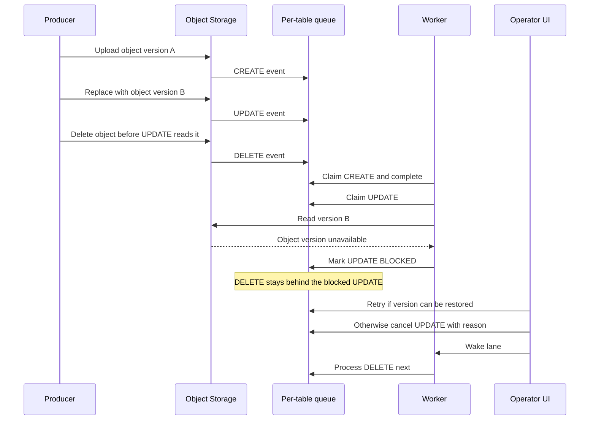

The safe producer workflow is to wait for terminal completion before replacing
or deleting the same object, or retain every referenced object version until
the queue no longer needs it. For high-volume publication, immutable object
names plus an explicit producer sequence or manifest are safer than repeatedly
overwriting one name.

## Performance and workflow validation

Two evidence sets are relevant and must not be conflated:

1. The suffix-7 validation proves the implemented queue ordering, lease,
   detached transport, UI recovery, lifecycle mutation, and cleanup workflow.
2. The VM-6 performance run measures the underlying streaming loader and
   Sync/Detached file-size envelope. It is not a sustained queue-contention
   benchmark.

### Queue workflow validation on suffix 7

Environment: MySQL.8 target, Function memory 2,048 MB, four writers, 300-second
Sync timeout, 3,600-second Detached timeout, TABLE scope, 90-second lease, and
30-second reorder grace.

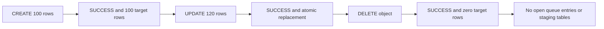

| Operation | Queue transition | Delivery latency | Queue wait | Worker processing | Object-event duration | Result |
| --- | --- | ---: | ---: | ---: | ---: | --- |
| CREATE | `PENDING → RUNNING → SUCCESS` | 4.742 s | 30.838 s | 0.450 s | 31.252 s | 100 rows published |
| UPDATE | `PENDING → RUNNING → SUCCESS` | 8.668 s | 30.298 s | 0.374 s | 30.687 s | Partition replaced with 120 rows |
| DELETE | `PENDING → RUNNING → SUCCESS` | 12.349 s | 30.284 s | 0.090 s | 30.404 s | Target returned to zero rows |

The roughly 30-second wait is expected because this validation used the
configured reorder grace. All three attempts recorded requested mode
`DETACHED` and actual transport `DETACHED`. The lane released its owner and
lease, the completion watermark advanced, and no staging table remained.

The same validation deliberately reproduced an overlapping UPDATE/DELETE
failure. The UPDATE became `BLOCKED` after Object Storage returned 404, the
following DELETE remained pending, and authenticated UI cancel plus worker wake
allowed the DELETE to finish without violating order. This confirms containment
and recovery behavior, not only the success path.

UI and runtime evidence from that run included:

- 33 of 33 automated UI tests passed;
- 17 of 17 authenticated views passed;
- 31 rendered JavaScript blocks passed syntax compilation;
- no final orphan staging table or non-terminal queue entry;
- Python 3.13 and Oracle MySQL Connector/Python 9.7.0 in the deployed UI;
- Function, OCI Events rule, nginx, UI service, and DB reachability validated.

### Streaming performance validation on VM 6

The primary wide-row workload used four writers, 10,000-row batches, 32 MiB
range reads, MySQL.8, and 1.3 TB allocated database storage.

| Object size | Mode | Rows | Processing duration | Throughput | Result |
| ---: | --- | ---: | ---: | ---: | --- |
| 10 MiB | SYNC | 19,773 | 1.691 s | 5.914 MiB/s | SUCCESS |
| 100 MiB | SYNC | 197,352 | 7.571 s | 13.208 MiB/s | SUCCESS |
| 500 MiB | SYNC | 985,920 | 33.474 s | 14.937 MiB/s | SUCCESS |
| 1 GiB | DETACHED | 2,017,031 | 69.076 s | 14.824 MiB/s | SUCCESS |
| 2 GiB | DETACHED | 4,031,976 | 137.089 s | 14.939 MiB/s | SUCCESS |
| 5 GiB | DETACHED | 10,076,665 | 343.368 s | 14.911 MiB/s | SUCCESS |

The demonstrated operational boundary remains 500 MiB for Sync and 5 GiB for
Detached. Larger sizes in the performance report are projections, not validated
guarantees. Wide-row throughput was nearly linear from 500 MiB through 5 GiB.

A controlled narrow-row 5 GiB comparison completed in 1,120.274 seconds on the
1.3 TB allocation versus 1,408.743 seconds on the earlier 50 GB allocation.
Byte throughput improved from 3.634 to 4.570 MiB/s. Because cache state,
tenancy load, monitoring aggregation, and other conditions were not identical,
this is an environment-level comparison rather than proof that storage
allocation alone caused the gain.

### Performance measurement model

```mermaid
flowchart LR
    Generate["Generate deterministic CSV"] --> Upload["Measure upload duration"]
    Upload --> EventTime["Capture CloudEvent time"]
    EventTime --> Received["Capture Function received time"]
    Received --> Queued["Capture queue start time"]
    Queued --> Completed["Capture attempt and event completion"]
    Completed --> VerifyRows["Verify exact target row count"]
    VerifyRows --> Delete["Delete object and measure cleanup"]
    Delete --> VerifyFinal["Verify zero rows, no stage, no active lease"]
```

Report these measurements separately:

| Metric | Calculation or source |
| --- | --- |
| OCI delivery latency | Function `received_at − event_time` |
| Queue wait | Queue `started_at − received_at` |
| Worker duration | `queue_attempt.completed_at − queue_attempt.started_at` |
| Object-event duration | `object_event.completed_at − object_event.received_at` |
| End-to-end latency | Final completion minus CloudEvent time |
| Byte throughput | Actual object bytes divided by worker processing duration |
| Row throughput | Validated rows divided by worker processing duration |
| Cleanup duration | DELETE worker start to terminal partition removal |

### Queue-specific performance tests still required

The current evidence validates correctness but does not yet establish queue
capacity under heavy contention. A complete queue benchmark should add:

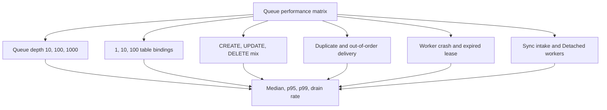

Measure enqueue latency, lane-acquisition contention, queue wait, entries per
second, continuation count, duplicate coalescing, recovery time after lease
expiry, and p95/p99 end-to-end latency. Run TABLE and safe MAPPING scopes
separately. Preserve object versions during the test so an Object Storage 404
does not invalidate the queue-capacity result.

## Configuration and tuning

| Setting | Default or deployed example | Effect |
| --- | ---: | --- |
| `QUEUE_LEASE_SECONDS` | 90 s | Lane and entry ownership lifetime; heartbeat extends it. |
| `QUEUE_REORDER_GRACE_SECONDS` | 30 s | Delay before a newly received head entry becomes eligible. |
| `QUEUE_SHUTDOWN_RESERVE_SECONDS` | 120 s | Detached time retained for safe shutdown and handoff. |
| `QUEUE_MINIMUM_START_SECONDS` | 180 s | Minimum Detached budget before starting another job. |
| `QUEUE_SYNC_RESERVE_SECONDS` | 15 s | Sync handoff reserve when configured. |
| `QUEUE_SYNC_MINIMUM_START_SECONDS` | 15 s | Minimum Sync budget when configured. |
| `QUEUE_EXPECTED_BYTES_PER_SECOND` | 4 MiB/s | Conservative admission estimate for known object sizes. |
| `QUEUE_PREDICTION_SAFETY_FACTOR` | 1.35 | Multiplier applied to estimated processing duration. |
| `FUNCTION_TIMEOUT` | 300 s maximum | Sync invocation budget. |
| `DETACHED_TIMEOUT_SECONDS` | 3,600 s maximum | Detached invocation budget. |
| `OBJECT_STORAGE_RANGE_BYTES` | 32 MiB | Maximum range response and an important memory bound. |
| `BATCH_ROWS` | 10,000 | Rows submitted to a writer in one batch. |
| `WRITER_WORKERS` | 4 | Default parallel MySQL writers; mappings may snapshot their own value. |

Tune the expected byte rate from measured p10 or other conservative sustained
throughput, not the fastest observed run. Runtime prediction is an admission
safety mechanism, not a scheduler guarantee.

## Assumptions and limitations

- One file owns one complete logical partition of a table. Records duplicated
  across active files are unsupported.
- Partition exchange is atomic for one file only. Multiple files and bindings
  are not one transaction.
- Moving rows between files requires the source removal to complete before the
  destination addition unless an external coordinated cutover is used.
- TABLE scope preserves one observed sequence for a target. MAPPING scope does
  not coordinate with other mappings, even if they target the same table.
- The queue orders events that have arrived. Strict producer business sequence
  requires immutable sequence numbers, a manifest, or producer acknowledgement.
- Event time depends on trustworthy producer and OCI timestamps. Priority does
  not override event-time order.
- A BLOCKED head intentionally prevents later work from running.
- Object versions must remain readable until their CREATE or UPDATE completes.
- Sync and Detached executions have hard platform time limits. Split files
  that cannot fit the safe budget; smaller ordered chunks also reduce retry
  cost and orphan-stage risk.
- A hard platform termination can leave a staging table. Use Registered Table
  cleanup only after confirming that no active loading lease owns it.
- Increasing writer or binding concurrency can move the bottleneck to MySQL
  connections, CPU, volume throughput, IOPS, or network.
- OCI Events rules and mapping patterns should be mutually exclusive. Multiple
  matching rules can enqueue distinct deliveries unless they retain the same
  CloudEvent identity.

## Related documentation and evidence

- [Technical deployment and operations guide](technical-details.md)
- [Diskless parallel CSV streaming implementation](diskless-parallel-csv-streaming-implementation.md)
- [Parallel CSV streaming implementation](csv-stream-parallelization-implementation.md)
- [Repeatable performance-test setup](../performance_test/README.md)
- [VM-6 performance report](../external-reports/performance-test-report-vm6-20260719.md)
- Suffix-7 workflow validation: `reports/full_workflow_ui_validation_20260720.html`

The suffix-7 validation report is a local HTML assessment artifact under the
Git-ignored `reports/` directory. The design and externally shareable measured
performance reports are retained as versioned Markdown.
