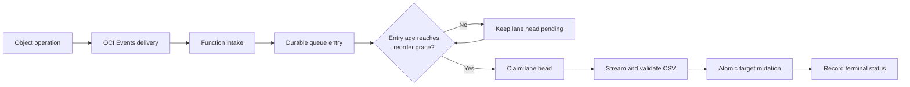
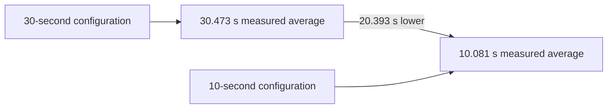
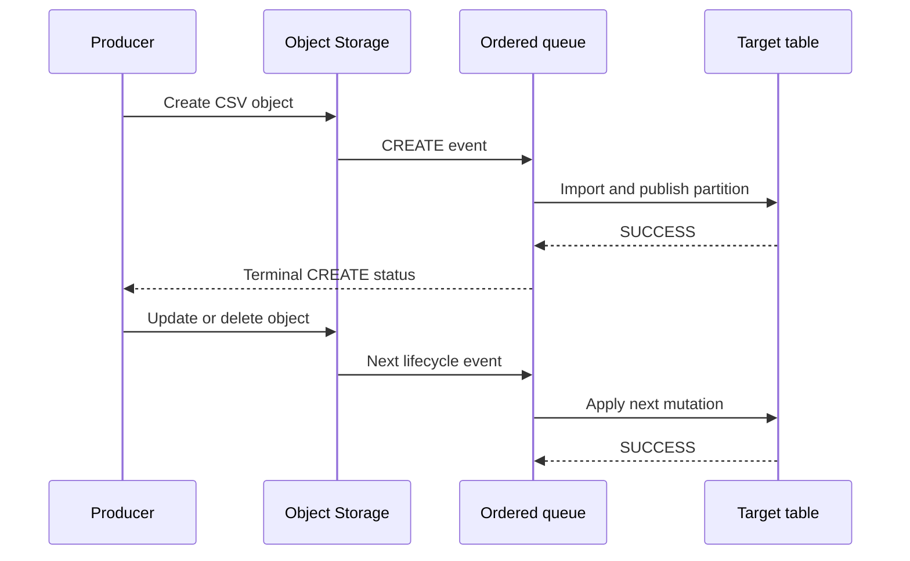

# Queue reorder-grace test: 10 seconds versus 30 seconds

## Purpose

This document defines repeatable test scenarios for a 10-second and a
30-second ordered-queue wait and compares the measured suffix-7 results from
20 July 2026.

`QUEUE_REORDER_GRACE_SECONDS` is the minimum age of the lane-head entry before
the Function may claim it. The grace period gives an earlier Object Storage
lifecycle event time to arrive before a later event mutates the same mapped
table or mapping lane.

It is important to separate this wait from OCI Events delivery latency:

```text
OCI delivery latency = object_event.received_at - object_event.event_time
Queue wait          = event_work_queue.started_at - event_work_queue.received_at
Worker execution    = event_work_queue.completed_at - event_work_queue.started_at
```

## Ordered timing model



The queue sorts non-terminal entries by:

```text
event_time ASC, received_at ASC, priority ASC, queue_id ASC
```

The grace period improves the opportunity to observe closely delivered events;
it does not prove that every earlier event has arrived.

## Test environment

| Item | Value |
|---|---|
| Deployment | Suffix 7 on `141.147.81.7` |
| OCI region | `uk-london-1` |
| Function | `object-storage-heatwave7` |
| Function memory | 2,048 MiB |
| Sync timeout | 300 seconds |
| Detached timeout | 3,600 seconds |
| Writer threads | 4 |
| Queue scope | `TABLE` |
| Queue lease | 90 seconds |
| Control schema | `fndb7` |
| Target | `fntestdb.perf_t_001` |
| Object pattern | `performance/vm7/perf_t_001/*` |

## Common preparation

Use the following preparation for both scenarios:

1. Confirm the Function is `ACTIVE`, the Events rule is enabled, the rule
   targets the current Function, and Object Storage event emission is enabled
   for the bucket.
2. Confirm the mapping resolves the test prefix to
   `fntestdb.perf_t_001` and uses `TABLE` queue scope.
3. Confirm no earlier non-terminal entry is blocking the lane.
4. Use a unique object name for each run so historical or duplicate delivery
   cannot be mistaken for the current test.
5. Change the grace value in **Mappings → OCI Function Configuration** and
   wait for the Function update to return to `ACTIVE`.
6. Read the live Function configuration back from OCI before uploading the
   object.
7. Record UTC timestamps and keep the VM, Function, and MySQL clocks
   synchronized.

## Scenario A: 30-second wait

### Configuration

Set:

```text
QUEUE_REORDER_GRACE_SECONDS=30
```

### Lifecycle test

1. Upload a unique CSV containing 100 rows.
2. Wait for CREATE to reach `SUCCESS` and verify 100 target rows.
3. Replace the same object with a CSV containing 120 rows.
4. Wait for UPDATE to reach `SUCCESS` and verify 120 target rows.
5. Delete the object only after UPDATE is terminal.
6. Wait for DELETE to reach `SUCCESS` and verify zero target rows.
7. Confirm all three queue attempts are terminal and no staging table remains.

### Measured 30-second result

This run used Detached mapping execution.

| Operation | OCI delivery latency | Queue wait | Worker execution | Object-event duration | Result |
|---|---:|---:|---:|---:|---|
| CREATE | 4.742 s | 30.838 s | 0.450 s | 31.252 s | SUCCESS; 100 rows |
| UPDATE | 8.668 s | 30.298 s | 0.374 s | 30.687 s | SUCCESS; 120 rows |
| DELETE | 12.349 s | 30.284 s | 0.090 s | 30.404 s | SUCCESS; zero rows |
| **Average** | **8.586 s** | **30.473 s** | **0.305 s** | **30.781 s** | **3 of 3 passed** |

## Scenario B: 10-second wait

### Configuration

Set:

```text
QUEUE_REORDER_GRACE_SECONDS=10
```

### Lifecycle test

1. Generate a unique 102,787-byte CSV containing 195 rows.
2. Upload it as a new object under the mapped prefix.
3. Wait for CREATE to reach `SUCCESS` and verify 195 target rows.
4. Delete the object only after CREATE is terminal.
5. Wait for DELETE to reach `SUCCESS` and verify zero target rows.
6. Query the queue timestamps and confirm no staging table remains.

### Measured 10-second result

This run used Sync mapping execution.

| Operation | Queue received UTC | Worker started UTC | Queue wait | Worker execution | Result |
|---|---|---|---:|---:|---|
| CREATE | 10:38:34.173387 | 10:38:44.255900 | 10.0825 s | 0.7235 s | SUCCESS; 195 rows |
| DELETE | 10:39:01.275237 | 10:39:11.354124 | 10.0789 s | 0.0938 s | SUCCESS; zero rows |
| **Average** | — | — | **10.0807 s** | **0.4087 s** | **2 of 2 passed** |

The CREATE event had 60.128 seconds of OCI delivery latency in this run. That
delivery delay occurred before queue receipt and is not evidence that the
10-second queue setting failed.

## Comparison

| Measure | 30-second run | 10-second run | Difference |
|---|---:|---:|---:|
| Configured grace | 30 s | 10 s | -20 s |
| Average measured queue wait | 30.473 s | 10.081 s | -20.393 s |
| Average excess above configured grace | 0.473 s | 0.081 s | -0.393 s |
| Lifecycle operations tested | CREATE, UPDATE, DELETE | CREATE, DELETE | UPDATE not repeated at 10 s |
| Requested execution mode | Detached | Sync | Different transport modes |
| Successful operations | 3/3 | 2/2 | Both passed |
| Staging residue | None | None | Equivalent |

The measured average queue wait fell by approximately **66.9%** when the grace
was reduced from 30 seconds to 10 seconds. This is the expected fixed-wait
effect, not a CSV ingestion throughput improvement. Once claimed, the small
files in both runs completed in less than one second.



## Measurement query

Use queue timestamps rather than the Object Storage event timestamp to validate
the configured grace:

```sql
SELECT
    id,
    event_action,
    invocation_mode,
    status,
    received_at,
    started_at,
    completed_at,
    TIMESTAMPDIFF(MICROSECOND, received_at, started_at) / 1000000
        AS queue_wait_seconds,
    TIMESTAMPDIFF(MICROSECOND, started_at, completed_at) / 1000000
        AS worker_execution_seconds
FROM fndb7.event_work_queue
WHERE resource_name = ?
ORDER BY id;
```

Acceptance criteria:

- terminal status is `SUCCESS`;
- `queue_wait_seconds` is at least the configured grace;
- the measured wait is reasonably close to the configured value after allowing
  for Function scheduling, database work, and the queue polling interval;
- target row counts match the expected CREATE, UPDATE, and DELETE state;
- no orphaned staging table remains.

## Assumptions

- All lifecycle events for a target table use the same `TABLE` binding and
  therefore one serialized lane.
- Producers wait for terminal completion before updating or deleting the same
  object.
- The relevant object version remains readable until its CREATE or UPDATE work
  completes.
- Event timestamps are valid UTC values and system clocks are synchronized.
- The live Function configuration has propagated before the test upload.
- Mapping patterns and OCI Rules are mutually exclusive, except for expected
  at-least-once redelivery of the same event ID.
- Database health, Function capacity, and network conditions are stable enough
  that scheduling noise does not dominate the configured wait.

## Limitations

1. **The two measured runs are not a controlled transport comparison.** The
   30-second run used Detached execution and included UPDATE; the 10-second run
   used Sync execution and did not repeat UPDATE. Queue wait is comparable
   because both transports call the same claim policy, but worker and
   end-to-end durations should not be compared as transport benchmarks.
2. **The sample is small.** Five lifecycle operations demonstrate correct
   behavior but do not establish percentile latency under concurrency.
3. **OCI Events delivery is nondeterministic and at least once.** Delivery may
   take longer than either grace value, and duplicate invocation remains
   possible.
4. **A grace period is not a complete ordering guarantee.** An earlier event
   delivered after the grace and after a later event completes is blocked by
   the lane watermark for operator review; it is not silently reordered.
5. **Grace is currently Function-wide.** It applies to new queue workers across
   mappings rather than being independently tuned for each mapping.
6. **Waiting consumes Function lifetime.** A 30-second wait leaves less of the
   300-second Sync budget for CSV import than a 10-second wait. Admission
   reserves and large-file mode selection must still be respected.
7. **A warm or already-running invocation may have older environment state.**
   Validate the live configuration and use a new event after the OCI Function
   update reaches `ACTIVE`.
8. **The worker polls while waiting.** Start time can exceed the configured
   threshold because of the bounded polling interval, OCI scheduling,
   database latency, or lane contention.

## Operational recommendation

Use **30 seconds** when CREATE, UPDATE, and DELETE operations can be emitted
close together by independent producers and the additional latency is
acceptable. Use **10 seconds** when producers serialize same-object operations,
retain object versions until terminal completion, and small-file latency is
more important.

Do not treat a shorter grace as a substitute for producer ordering. For the
safest workflow:



Future performance validation should repeat both wait values with the same CSV,
execution mode, lifecycle sequence, and at least 30 iterations, then report
median, p95, and maximum queue-wait overshoot separately from OCI delivery
latency and worker execution time.
