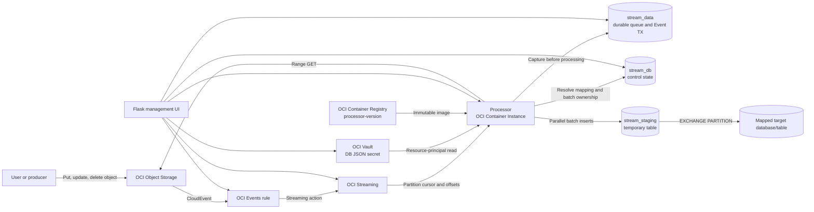
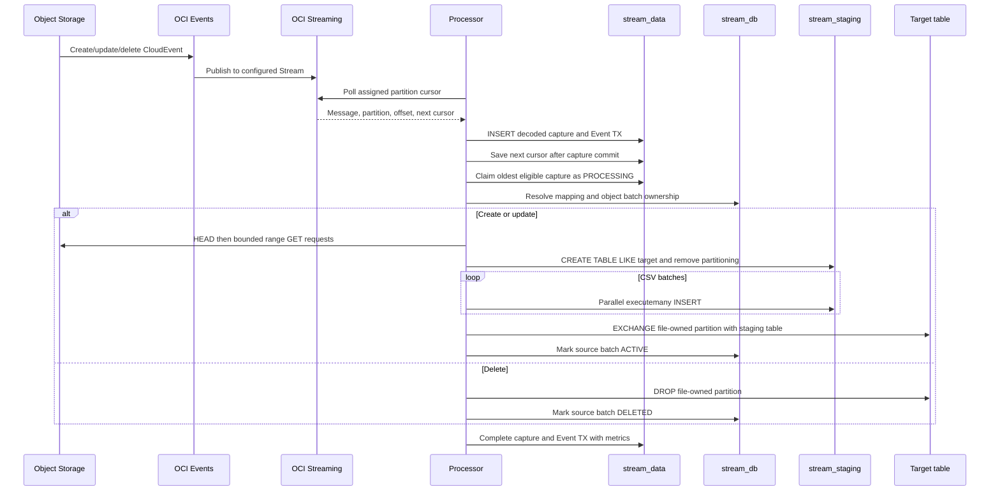
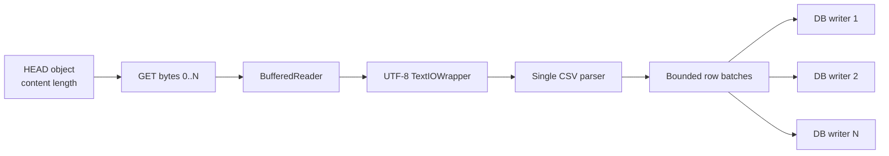
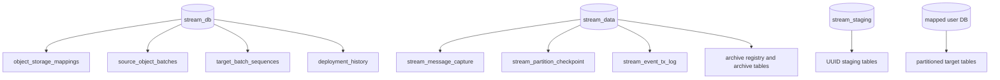

# Technical architecture: Object Storage events to HeatWave tables

## Purpose

This system converts OCI Object Storage create, update, and delete events into
ordered, durable, observable changes in mapped MySQL HeatWave tables. It uses
OCI Events and OCI Streaming for event delivery, OCI Container Instances for
processing, OCI Vault for database connectivity, and a partition-exchange
loader for efficient and atomic publication of each CSV object.

The architecture replaces the earlier OCI Function target. A Function is useful
for short, independent invocations, but it does not provide the explicit
long-lived partition ownership, durable retry queue, deployment sizing, or
ordering control required by this loader. OCI Streaming provides the ordering
boundary and decouples event arrival from database processing.

## Component architecture

### Component responsibilities

| Component | Responsibility | Important behavior |
|---|---|---|
| Object Storage | Stores source CSV objects and emits create/update/delete events | An object is the ownership unit for one target partition. Moving/renaming an object is not an atomic move event. |
| OCI Events rule | Filters compartment, bucket and object-name patterns and routes matching CloudEvents | The action targets OCI Streaming, not OCI Functions. Disable the rule before source cleanup when target deletion is not intended. |
| OCI Streaming | Buffers events and provides partition-local ordered offsets | FIFO uses one partition. Parallel mode uses multiple partitions and does not guarantee global order. Delivery is at least once. |
| Processor Container Instance | Polls assigned Stream partitions, captures messages durably, and executes the loader | Runs continuously with explicit partition ownership and a resource principal. Runtime configuration is replaced, not edited in place. |
| OCI Vault and KMS | Stores the base64 JSON database bundle encrypted by an AES key | Only the secret OCID is passed to the Processor. Credentials are not stored in source, image tags, deployment history or UI profiles. |
| OCIR | Stores immutable UI and Processor images | A logical version produces `processor-<version>` and `ui-<version>` tags in one repository. |
| Control database | Stores mappings, source-object batch ownership, batch sequences and release history | Separates bounded orchestration state from growing durable message data. |
| Durable database | Stores decoded messages, offsets, checkpoints, attempts, errors, timings and archives | Makes retry independent of Stream cursor lifetime and retention after capture. |
| Staging database | Holds transient, UUID-named tables during loads | Prevents loader artifacts from appearing in user target schemas. Orphans remain visible for operational cleanup after abnormal termination. |
| Target database | Holds user-visible partitioned tables | Each active source object owns one `LIST(batch_num)` partition. |
| Flask UI | Manages Streams, rules, mappings, secrets, Processor deployments, durable messages and transactions | UI Connection Profiles are separate from Processor Vault connectivity. |

## Why OCI Streaming instead of OCI Functions

The original design mapped an Object Storage event directly to an OCI Function.
That created several architectural problems:

- Function invocations are independent and do not establish a durable single
  consumer for one ordered sequence.
- Synchronous or detached Function invocation describes invocation behavior,
  not FIFO data ordering.
- Large CSV processing can exceed the comfortable lifecycle of a short-lived
  invocation and needs controllable CPU, memory, worker count and retry state.
- Retrying an invocation without a durable application record makes it harder
  to distinguish an at-least-once replay from unfinished work.
- Parallel Functions can update the same target table without a clear
  partition-ownership contract.

OCI Streaming solves the transport and ordering part of the problem:

- Each message has a Stream OCID, partition and monotonically ordered offset.
- One FIFO Processor owns partition `0`, so it claims messages sequentially.
- Parallel deployments assign disjoint partition sets to Processor replicas.
- Event production is decoupled from potentially slower Object Storage reads
  and HeatWave writes.
- The Processor captures each message in MySQL before processing it, creating a
  durable application queue and transaction record.

Streaming does not create a global exactly-once guarantee. The application adds
idempotency through unique `(stream_id, partition_id, stream_offset)` capture
keys and source-object ownership records.

## Ordering and processing modes

| Mode | Stream topology | Processor topology | Guarantee | Use case |
|---|---|---|---|---|
| FIFO | Exactly one partition | Exactly one replica assigned partition `0` | Ordered processing within the mapping | Updates/deletes must follow creates in one deterministic sequence |
| Parallel | Two or more partitions | One or more replicas with disjoint explicit assignments | FIFO only within each partition; no global ordering | Independent objects can be processed concurrently and throughput matters more than cross-object order |

OCI Container Instances do not assign Stream partitions automatically in this
design. `PROCESSOR_PARTITIONS` explicitly declares ownership. The deployment
validation prevents duplicates, out-of-range assignments, FIFO assignments
other than `0`, and replica counts greater than the Stream partition count.

Ordering is meaningful only inside one Stream partition. The recovery rule for
an older create/update hidden by a later delete therefore searches only the
same Stream and partition at a higher offset.

## End-to-end message lifecycle

### Durable capture before execution

The Processor decodes the base64 Stream value into a JSON CloudEvent and writes
two records in one database transaction:

- `stream_message_capture` is the durable work queue and payload record;
- `stream_event_tx_log` is the transaction lifecycle and operational view.

Only after capture commits does the Processor persist the next Stream cursor.
If a cursor expires, the Processor recreates it from trim horizon. Already
captured offsets are harmless because the capture unique key makes replay
idempotent.

The claim sequence is `CAPTURED → PROCESSING → COMPLETED` or `FAILED`. Failed
records use bounded exponential retry delays up to 300 seconds. A processing
lease returns abandoned `PROCESSING` records to `FAILED` after a Processor
interruption, allowing another attempt.

### Exceptional ordering case: source deleted before create is read

A source object can be created and deleted quickly. The earlier create/update
message may then receive Object Storage HTTP 404 even though a later delete is
already durably captured. Retrying the older message forever would block FIFO.

The Processor treats the older load as superseded only when all of these are
true:

1. the failed message is create or update;
2. the Object Storage failure is HTTP 404;
3. a delete for the same bucket/object is durably captured;
4. that delete has a higher offset in the same Stream partition.

An unrelated 404 remains retryable. This rule preserves partition-local order
without incorrectly inferring order across parallel partitions.

## Mapping and object ownership

The Processor resolves a mapping by exact compartment and bucket plus a
case-sensitive object-name pattern. If more than one pattern matches, the most
specific/longest pattern wins. A missing mapping fails visibly rather than
writing to an inferred target.

The control database hashes mapping ID, bucket and object name into a stable
source key. `source_object_batches` assigns one durable `batch_num` to that
object. `target_batch_sequences` allocates unique batch numbers per target
database/table under row locking.

This provides:

- replay-safe ownership for the same object and event version;
- stable update replacement of the object's existing partition;
- exact delete of only the object's owned partition;
- no dependence on approximate `information_schema` row estimates.

## Diskless Object Storage reading

Large objects are not downloaded to a temporary file. The Processor performs a
HEAD request to obtain content length and exposes a seek-free raw stream backed
by bounded HTTP byte ranges. The default range is 32 MiB and the minimum is
1 MiB.

Short-lived range responses avoid holding one OCI SDK response open while slow
database commits apply backpressure. Only the active buffer, current CSV batch,
and a bounded set of pending insert batches occupy memory. This avoids a second
full-file copy, duplicate parsing, local disk capacity requirements, and cleanup
of temporary source files.

The CSV is parsed once in source order. Parallel database writers receive
different batches from that one parser, so worker parallelism does not duplicate
the workload. Header names are matched case-insensitively to target columns;
missing or unknown columns fail the load. Empty scalar values and a complete
`-` marker are bound as SQL `NULL`, avoiding strict numeric/date conversion
errors while preserving hyphens inside ordinary text.

## Batch insertion

`BATCH_ROWS` defaults to 10,000. The CSV reader constructs a list of parameter
tuples and submits it to a `ThreadPoolExecutor`. Each worker opens an independent
MySQL connection and performs a parameterized `executemany INSERT` into the
same staging table. Pending work is bounded to twice the worker count, so a fast
Object Storage reader cannot create an unbounded in-memory queue behind a slow
database.

| Setting | Default | Effect | Scaling risk |
|---|---:|---|---|
| `BATCH_ROWS` | 10,000 | Rows per `executemany` transaction | Larger batches use more memory and increase retry cost; small batches increase round trips and commits |
| `WRITER_WORKERS` | 4 | Concurrent insert connections per Processor | More workers can improve ingest until database CPU, redo, locks or storage becomes the bottleneck |
| `OBJECT_STORAGE_RANGE_BYTES` | 32 MiB | Maximum bytes per Object Storage GET response | Small ranges add request overhead; very large ranges increase response lifetime during DB backpressure |
| `OBJECT_STORAGE_READ_TIMEOUT_SECONDS` | 300 | Read timeout for an active range response | Must tolerate pauses caused by batch commits without masking genuine network failure |

The deployment UI exposes writer workers per mapping. Range size, read timeout
and batch size are advanced runtime defaults in the Processor image/environment
and should be changed only through a tested deployment contract.

## Partition-exchange loader

### Target-table contract

The mapped target table must:

- be a base table;
- contain an invisible `batch_num` column;
- use `LIST` partitioning by `batch_num`;
- include `batch_num` in every unique key;
- have at least one CSV-loadable non-generated, non-invisible,
  non-auto-increment column.

The permanent `p_seed` partition reserves the initial structure. Each active
source object receives `p_batch_<batch_num>`.

### Create and update

1. Allocate or recover the object's batch record under a control-table lock.
2. Add the target partition if it does not exist.
3. Create a UUID-named staging table in `stream_staging` with `CREATE TABLE LIKE
   target`, then remove its partitioning.
4. Stream and insert every CSV row into staging with the object's `batch_num`.
5. Validate that staging contains no unexpected batch number.
6. Execute `ALTER TABLE target EXCHANGE PARTITION ... WITH TABLE stage WITHOUT
   VALIDATION`.
7. Mark the source batch ACTIVE and drop the now-detached staging table.

The application validates the batch number before using `WITHOUT VALIDATION`.
Because the stage table is structurally cloned from the target, the exchange is
a metadata operation: readers see the previous complete object partition until
the new complete partition is published. They do not see a partially inserted
file.

For update, the same file-owned partition is exchanged with newly loaded
staging data. After exchange, the old partition contents reside in the staging
table and are removed when that table is dropped.

### Delete

Delete counts the rows owned by the object's batch, drops the complete target
partition, and marks the batch record DELETED. It intentionally uses `DROP
PARTITION`, not `TRUNCATE PARTITION`, so deleted objects do not leave an
ever-growing set of empty partitions. A later create re-adds the required
partition before loading.

MySQL limits a table to 8,192 partitions. With one permanent seed partition,
the design supports at most 8,191 simultaneously active file-owned partitions
per target table. Archive/delete old objects, distribute data across target
tables, or perform an operator-controlled consolidation strategy before reaching
the limit. Manually merged data is no longer independently removable by the
original object-to-partition delete operation and must be governed accordingly.

## Database separation

Control state is expected to remain comparatively small. Durable message and
transaction history can grow and is isolated for retention, archive and cleanup
operations. Transient staging is separate so interrupted processing does not
leave internal tables in user databases. Target schemas contain only mapped
user tables.

Schema initialization and migrations are external SQL under `loader_core/sql/`,
`processor/sql/`, and `ui/myapp/sql/`. Python reads and executes those tracked
files rather than embedding application DDL in route or processing logic.

## Metrics and observability

### Per-message application metrics

Both durable capture and Event TX store:

| Metric | Meaning |
|---|---|
| Stream ID, partition and offset | Exact ordered source position and idempotency key |
| Processor release stamp | Image/release that handled the message |
| Status and attempts | `CAPTURED`, `PROCESSING`, `COMPLETED`, `FAILED` and retry count |
| Received/completed timestamps | End-to-end application processing interval after capture |
| Rows affected | Loaded, replaced or deleted rows owned by the event |
| Object size bytes | Source size returned by Object Storage for create/update |
| Loader duration | Combined range read, CSV parse, batch queue/backpressure and staging inserts |
| Exchange duration | Partition exchange or delete partition DDL time |
| Error and next retry time | Failure diagnosis and bounded backoff schedule |

The UI exposes recent transactions, object events, durable payloads, retries,
registered target tables, orphan staging tables and release/deployment history.

### OCI and MySQL capacity metrics

Collect these alongside the application metrics:

- HeatWave CPU utilization;
- current connections and running threads;
- statement rate/count;
- DB volume write operations, write latency, queue depth and throttling when
  available;
- redo/commit waits, row/metadata lock waits and fsync behavior;
- buffer-pool logical/physical reads and hit ratio;
- temporary table and disk-temporary-table counts;
- target and staging schema growth;
- Processor Container Instance CPU and memory utilization;
- Stream backlog/consumer lag by partition;
- Object Storage request latency, range throughput and errors.

Current `loader_duration_ms` intentionally measures the whole streaming loader
phase. It does not yet separate Object Storage transfer, CSV parsing, queue wait,
insert execution and commit. That boundary is important: a throughput plateau
cannot be attributed conclusively to Object Storage, Processor CPU, MySQL
compute or storage IOPS without per-phase timing.

## Performance findings and challenges encountered

### Function ordering was the wrong abstraction

The initial Function-oriented model exposed synchronous/detached execution
settings but could not make them equivalent to FIFO. Moving to a one-partition
Stream with one explicitly assigned continuous Processor established an actual
ordering boundary and made retry state inspectable.

### Large-object reads and database backpressure

A single long-lived Object Storage response can remain open while several
database workers commit batches. Range streaming shortened response lifetime
and removed temporary-file I/O, but the measured loader interval still combines
source transfer and database work. Object Storage can therefore be a residual
bottleneck even when the database is enlarged.

### Database capacity dominated the first concurrent test

Two major FIFO campaigns used the same per-mapping Processor allocation
(`CI.Standard.E4.Flex`, 1 OCPU, 16 GiB and four writers) but different database
deployments. The observed comparison was:

| Workload | Smaller deployment: MySQL.2 / 50 GB | Larger deployment: MySQL.8 / 1,300 GB | Change |
|---|---:|---:|---:|
| 500 MiB single object | 4.294 MiB/s | 9.085 MiB/s | +111.6% |
| 1 GiB single object | 4.336 MiB/s | 10.178 MiB/s | +134.7% |
| 10 FIFO mappings, 500 × 1 MiB objects | 2.262 MiB/s | 3.892 MiB/s | +72.1% |
| 1-to-10 mapping scale efficiency | 55.7% | 80.1% | +24.4 percentage points |
| High-load database CPU | 79.19% average | 24.88% average | materially lower |
| High-load reported write operations | 1,305.884 average | 2,322.756 average | +77.9% |

This demonstrates that the earlier shared database path was a material
bottleneck. It does **not** isolate the contribution of shape, storage/IOPS or
software because the database shape, allocation and Processor release changed
together. The larger test's approximately 9–10 MiB/s single-file plateau may
include Object Storage/network throughput, sequential parsing, per-Processor
capacity or residual database transaction cost.

### More workers do not guarantee more throughput

Five independent mappings scaled close to linearly in both campaigns. The
smaller database improved only 1.25× when moving from five to ten Processors,
while the larger deployment improved 1.64×. This is consistent with independent
writers converging on a shared database write/redo/commit subsystem. Increasing
workers or replicas after that point raises connections and contention without
proportional throughput.

### At-least-once and interruption recovery

Duplicates, expired cursors, transient failures and Processor replacement are
normal operating conditions. Durable offset uniqueness, source ownership,
processing leases and retry backoff were required to keep these conditions from
duplicating target data or leaving captures permanently stuck.

### Staging and partition lifecycle

Failed initialization can leave an orphan staging table, and deletion originally
risked leaving empty partitions. UUID staging names prevent collision, the UI
surfaces orphan stages for cleanup, and delete now drops the object-owned
partition. The 8,192-partition table limit remains a capacity constraint rather
than an implementation defect.

### Deployment and security integration

Correct operation required explicit OCI resource-family policies, particularly
`compute-container-family`, virtual-network access, Stream management, secret
metadata/bundle access, Vault key use and repository access. Processor database
credentials were moved into a complete Vault JSON bundle, and static OCIR
authentication tokens were removed in favor of instance/resource principals.

## Scaling strategy

Scale one layer at a time and preserve a comparable workload so the limiting
resource can be identified.

### 1. Establish a baseline

For each file size and concurrency level, record object bytes, rows, received
and completed timestamps, loader/exchange durations, attempts, database CPU,
connections, running threads, statements and write metrics. Confirm exact target
rows and partitions before treating a run as a performance result.

### 2. Tune batch insertion within one Processor

1. Keep FIFO and one Processor fixed.
2. Test worker counts such as 2, 4 and 8.
3. Vary `BATCH_ROWS` conservatively while measuring memory, insert/commit time
   and retries.
4. Stop increasing workers when throughput flattens, database connections rise
   without useful gain, or redo/lock/write latency worsens.

This isolates database writer concurrency but not the sequential Object Storage
read/parser path.

### 3. Scale the Processor

- Increase OCPU when CSV parsing or TLS/range processing consumes the container
  CPU and database headroom remains.
- Increase memory only when measured batch/buffer pressure justifies it; the
  diskless design does not require memory proportional to object size.
- For independent objects, add Stream partitions and Processor replicas with
  disjoint assignments. This sacrifices global FIFO and requires that related
  create/update/delete events remain safely ordered within the same partition.
- Separate high-volume mappings into independent Streams/Processors when their
  ordering domains are independent.

### 4. Scale HeatWave/MySQL

- Increase database shape when CPU, running threads or statement execution is
  the constraint.
- Increase storage allocation/IOPS capacity when write latency, queue depth,
  throttling, redo/commit waits or volume metrics show a storage path limit.
- Ensure buffer-pool and temporary-table metrics do not indicate a read-cache or
  spill problem.
- Compare the same Processor image, shape, worker count and object workload
  before and after one database change. Changing shape and storage together
  proves deployment improvement but not causal attribution.

### 5. Scale Object Storage ingestion

- Measure each range GET duration and bytes separately from parsing/inserts.
- Tune range size only after measuring request overhead versus response lifetime.
- Keep source and Processor networking in the same region and validate service
  gateway/NAT routing as appropriate.
- If a single object's sequential parse is the ceiling, adding database workers
  will not fix it. Scale across independent objects/partitions or introduce a
  deliberately designed chunking format with clear ownership and recombination
  semantics.

### 6. Control partition growth

Track active file-owned partitions per target. Alert before the 8,191-object
ceiling, archive/delete retired sources with the intended event behavior, or
shard the mapping across target tables. Do not silently merge partitions when
future object-level delete semantics are still required.

## Recommended next instrumentation

Add these measurements before the next bottleneck investigation:

1. Object Storage HEAD and per-range request count, bytes and duration.
2. CSV parse duration and rows produced.
3. Batch queue wait, insert execution and commit duration per worker.
4. Peak pending batches and approximate buffered memory.
5. Stream newest offset versus durable completed offset per partition.
6. Processor CPU, memory and network utilization from OCI Monitoring.
7. HeatWave write latency, queue/throttle/IOPS capacity, redo waits and metadata
   lock duration.

These metrics would split `loader_duration_ms` into source, compute, queue and
database phases, allowing scaling decisions to be evidence-based.

## Security architecture

- The UI VM uses an instance principal for OCI discovery, image publication and
  managed-resource operations.
- Processor Container Instances use resource principals for Stream, Vault and
  Object Storage access.
- Database credentials exist only in OCI Vault and server-side authenticated UI
  session memory; UI Connection Profiles contain non-secret destinations.
- The Processor runs as a non-root container user and receives only its Stream,
  mode, partition assignment, Vault secret OCID and worker count.
- Processor VNICs use a private subnet. The public-facing UI terminates HTTPS at
  nginx and binds the Flask container to loopback.
- UI and Processor images are versioned immutably and retain secret-free build
  provenance.
- SQL identifiers are validated before interpolation; row values are bound as
  parameters.

## Source module map

| Concern | Primary implementation |
|---|---|
| Stream poll, partition ownership and processing loop | `processor/stream_processor.py` |
| Durable capture, checkpoint, retries and metrics | `processor/message_store.py` and `processor/sql/` |
| Vault JSON loading and environment isolation | `processor/vault_config.py` |
| CloudEvent routing and diskless Object Storage stream | `loader_core/event_processor.py` |
| Mapping, batch ownership, CSV batching and partition exchange | `loader_core/partition_loader.py` and `loader_core/sql/` |
| Event rules and mapping UI | `ui/myapp/services/event_rule_service.py`, `mapping_service.py` and corresponding route modules |
| Processor orchestration | `ui/myapp/services/orchestration_service.py` and `deploy/deploy_processor.sh` |
| Flow, durable and transaction observability | `ui/myapp/modules/flow_routes.py`, `durable_message_routes.py`, and `event_tx_routes.py` |
| Versioned image publication | `deploy/publish_release.sh`, `build_processor_image.sh`, and `deploy_ui.sh` |

## Related documentation

- [Setup and deployment guide](setup-and-deployment-guide.md)
- [Technical deployment and operations details](technical-details.md)
- [Project overview](../README.md)
