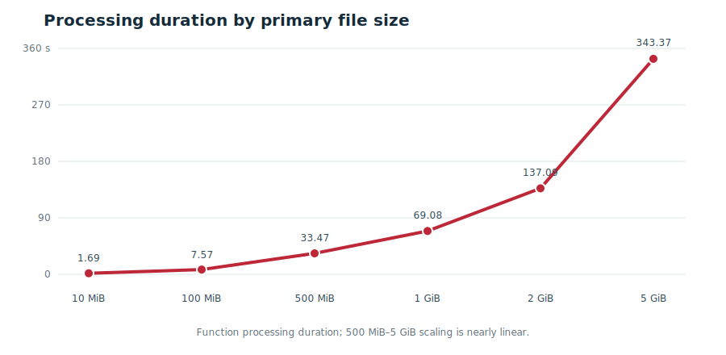
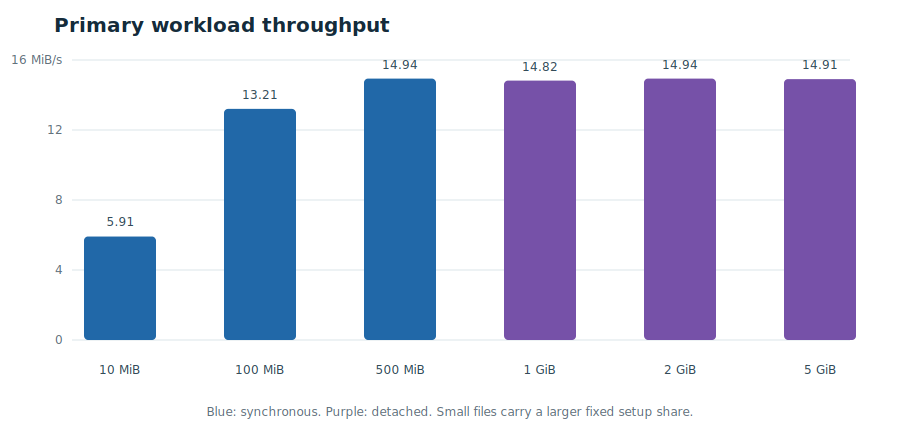
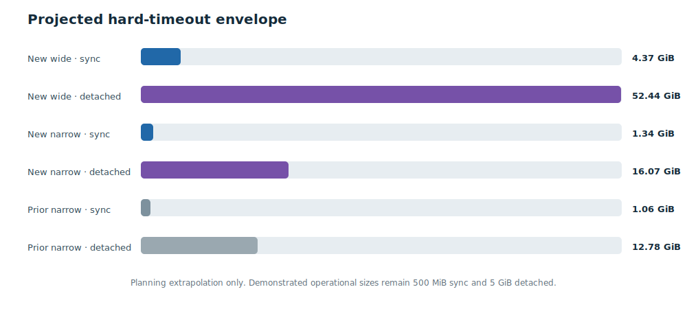

# Object Storage CSV ingestion to HeatWave — VM 6

Measured on 19 July 2026 using sequential Object Storage ingestion through OCI
Events and OCI Function, mapping-driven synchronous and detached execution,
streaming range reads, four MySQL writers, staging tables, and atomic partition
exchange.

## Executive result

| Result | Measurement |
| --- | ---: |
| Primary cases | **6 / 6 successful** |
| Largest measured object | **5 GiB** |
| 5 GiB Function processing | **343.368 seconds** |
| 5 GiB throughput | **14.911 MiB/s** |
| 5 GiB rows | **10,076,665** |
| New database storage allocation | **1.3 TB** |
| Previous database storage allocation | **50 GB** |
| Final rows, stages, active batches, live objects | **0** |

Synchronous ingestion passed at 10, 100, and 500 MiB. Detached ingestion
passed at 1, 2, and 5 GiB. Every case validated the exact row count, completed
partition exchange, deleted its source object, truncated the mapped partition,
and left no staging table.

The wide-row workload sustained approximately 14.9 MiB/s from 500 MiB through
5 GiB. A tenfold increase from 500 MiB to 5 GiB increased processing time by
10.26×, demonstrating nearly linear scaling.

A controlled 500 MiB narrow-row comparison closely matched the previous row
count: 8,096,895 rows now versus 8,080,750 previously. Processing improved from
117.454 to 108.640 seconds: **7.50% less time** and **8.09% higher throughput**.

> The 1.3 TB allocation is consistent with higher usable storage activity, but
> storage allocation is not isolated as the sole cause. Cache state, database
> load, object delivery, row width, batching, and monitoring aggregation also
> affect results.

## Architecture and environment

```text
testvm05               OCI Object           OCI Events       OCI Function              MySQL.8
generate + upload  ->  Storage bucket  ->   prefix rule  ->  sync / detached worker -> stage + exchange
```

| Component | Measured or configured value | Evidence |
| --- | --- | --- |
| Test VM | `testvm05`; VM.Standard.E5.Flex; 1 OCPU; 12 GB memory; Oracle Linux 9.8; 30 GB root | OCI instance metadata and host commands |
| Function | `object-storage-heatwave-app6/object-storage-heatwave6`; 2,048 MB | Live OCI lookup |
| Timeouts | Sync 300 seconds; detached 3,600 seconds | Live OCI lookup |
| Runtime | Python 3.13; Connector/Python 9.7+ | Container/dependency metadata |
| Function image | `object-storage-heatwave6:0.1.1` | Live OCI lookup |
| Streaming | 32 MiB Object Storage ranges; no Function-local CSV | Function configuration |
| Database writers | 4 workers; 10,000-row batches | Function configuration and mapping |
| Database service | MySQL.8; MySQL 9.7.1-cloud; 1.3 TB storage | Shape/storage operator-confirmed; version queried directly |
| MySQL runtime | 48 GiB InnoDB buffer pool; 4,000 max connections | Live MySQL variables |
| Durability | `innodb_flush_log_at_trx_commit=1`; `sync_binlog=1` | Live MySQL variables |
| Control and target | `fndb6`; `fntestdb.perf_t_001`; invisible `batch_num`; LIST partitioning | Live schemas |
| OCI rule | `object-storage-heatwave6-events`; `performance/vm6/perf_t_001/*` | Live OCI rule |
| Source revision | Base commit `1992ebb`, plus deployed mode-snapshot and runner changes | Git and deployment output |

The VM instance principal could not list MySQL DB systems. Shape and storage
allocation are therefore operator-confirmed. Credentials, private endpoints,
tokens, and full OCIDs are excluded.

## Method

1. Reset mapping 1 and `fntestdb.perf_t_001`; create the target, seed partition,
   non-secret UI profile, and exact resource mapping.
2. Generate deterministic CSV with valid
   `record_id,event_ts,category,payload,amount` columns. Primary rows used a
   480-byte payload and averaged about 533 bytes per row.
3. Upload one unique object at a time using multipart upload. Use sync through
   500 MiB, then dynamically switch the mapping to detached for 1–5 GiB.
4. Measure delivery latency from CloudEvent time to Function receipt. Measure
   processing duration from Function receipt to its terminal audit update.
5. Verify exact rows, terminal success, immutable execution-mode snapshot, and
   zero staging residue. Delete the object and wait for partition cleanup.
6. Run an additional 500 MiB file with a 12-byte payload, averaging 64.75 bytes
   per row, to match the previous 50 GB-storage workload.

## Measured results

| Case | Mode | Rows | Generate | Upload | Delivery | Processing | MiB/s | Seconds / 100 rows | Delete | Status |
| --- | --- | ---: | ---: | ---: | ---: | ---: | ---: | ---: | ---: | --- |
| 10 MiB | SYNC | 19,773 | 1.475 s | 1.718 s | 6.133 s | 1.691 s | 5.914 | 0.008551 | 0.166 s | SUCCESS |
| 100 MiB | SYNC | 197,352 | 1.150 s | 2.468 s | 12.490 s | 7.571 s | 13.208 | 0.003836 | 0.164 s | SUCCESS |
| 500 MiB | SYNC | 985,920 | 2.666 s | 6.678 s | 8.452 s | 33.474 s | 14.937 | 0.003395 | 0.164 s | SUCCESS |
| 1 GiB | DETACHED | 2,017,031 | 14.196 s | 11.880 s | 11.123 s | 69.076 s | 14.824 | 0.003425 | 1.035 s | SUCCESS |
| 2 GiB | DETACHED | 4,031,976 | 36.706 s | 20.475 s | 6.962 s | 137.089 s | 14.939 | 0.003400 | 1.207 s | SUCCESS |
| 5 GiB | DETACHED | 10,076,665 | 108.720 s | 46.199 s | 4.932 s | 343.368 s | 14.911 | 0.003408 | 1.896 s | SUCCESS |
| 500 MiB narrow comparison | SYNC | 8,096,895 | 12.487 s | 6.407 s | 12.025 s | 108.640 s | 4.602 | 0.001342 | 0.182 s | SUCCESS |

## Performance charts





## Storage allocation comparison: 1.3 TB versus 50 GB

| Controlled 500 MiB narrow case | Previous MySQL.8 / 50 GB | New MySQL.8 / 1.3 TB | Change |
| --- | ---: | ---: | ---: |
| Actual rows | 8,080,750 | 8,096,895 | +0.20% |
| Processing duration | 117.454 s | 108.640 s | **−7.50%** |
| Throughput | 4.258 MiB/s | 4.602 MiB/s | **+8.09%** |
| Rows per second | 68,799 | 74,529 | **+8.33%** |
| Observed disk operations peak | Approximately 496.508 | 1,936.5 | 3.90×, across different size cases |

The prior storage context was 50 GB, one LUN, and approximately 3,750
configured maximum IOPS. The new allocation is 1.3 TB and exhibited materially
higher database write-operation samples.

> The controlled byte and row counts make the 500 MiB duration comparison
> useful, but this is still one sequential sample per environment—not a storage
> benchmark. The primary new 5 GiB result cannot be compared directly with the
> previous 5 GiB result: the previous file contained 82.7 million narrow rows,
> versus 10.1 million wider rows now.

## Database monitoring evidence

The following OCI database-monitoring metrics were supplied at one-minute
timestamps. The displayed aggregation statistic was not provided, so values
retain the console's labels and are not automatically interpreted as service
limits.

| Metric | Relevant observation |
| --- | --- |
| CPU utilization, overlapping 14:08–14:32 samples | 9.284% average; 26.17% p95; 34.35% peak |
| 5 GiB database network receive plateau | 15.989 MiB average reported sample; 16.164 MiB peak |
| 5 GiB database network transmit plateau | 76.661 MiB average reported sample; 86.534 MiB peak |
| Disk write operations | 1,936.5 overall peak; 5 GiB phase average 1,249.826 and peak 1,870.048 |

During 14:30–14:34, database receive averaged 16.765 million bytes per reported
sample, or 15.989 MiB if the statistic is bytes/second. That is about 7.2% above
the measured 14.911 MiB/s CSV processing rate, consistent with SQL/protocol
overhead.

This establishes a steady pipeline rate but does **not** prove that the database
NIC or OCI network was saturated. A network limit requires the metric
aggregation, shape bandwidth limit, and a higher-concurrency test that attempts
to push above the plateau. Database transmit may include MySQL service,
replication, or internal traffic and cannot be attributed only to Function
responses.

CPU remained well below saturation while network traffic and disk operations
increased. The workload was therefore consistent with an I/O/pipeline constraint
rather than a CPU-bound MySQL.8 system.

## Projected maximum file size

The primary 500 MiB–5 GiB points fit:

```text
duration seconds = 0.0782 + 0.067038 × MiB
R² = 0.999996
```

Projection uses Function processing time only. “80% budget” reserves 20% for
variance. These are planning estimates, not OCI guarantees.

| Scenario | Basis | Sync hard 300 s | Sync 80% / 240 s | Detached hard 3,600 s | Detached 80% / 2,880 s |
| --- | ---: | ---: | ---: | ---: | ---: |
| New wide-row regression | 14.917 MiB/s fitted | 4.37 GiB | 3.50 GiB | 52.44 GiB | 41.95 GiB |
| New wide-row conservative | 13.208 MiB/s lowest bulk point | 3.87 GiB | 3.10 GiB | 46.44 GiB | 37.15 GiB |
| New narrow-row single point | 4.602 MiB/s at 500 MiB | 1.35 GiB | 1.08 GiB | 16.18 GiB | 12.94 GiB |
| Previous narrow-row sustained | 3.634 MiB/s at 5 GiB | 1.06 GiB | 0.85 GiB | 12.78 GiB | 10.22 GiB |



> The demonstrated operational sizes remain **500 MiB sync** and **5 GiB
> detached** until repeated warm/cold, concurrent, degraded-I/O, and p95 tests
> validate larger thresholds. Split large logical sources into ordered,
> disjoint objects when practical.

## Execution-mode logging defect found and fixed

During the run, the UI relabeled historical rows from the mapping's current mode
and showed a newly submitted detached event as sync until its worker completed.
The control database did not previously store an immutable execution-mode
snapshot.

- Added nullable `invocation_mode` snapshots to `object_event` and
  `event_tx_log`.
- The parent Function records the resolved mode immediately. Detached
  self-invocation carries the snapshot to its worker.
- Event TX, Object Storage Event, Registered Table, Recent TX, Audit Log, and
  Detached Process queries now read event snapshots rather than mutable mapping
  state.
- Known VM 6 performance rows were safely backfilled: 10 sync and 2 detached
  records before the change.
- A post-deployment canary persisted `DETACHED` on create and delete in both
  control tables.
- Legacy records without reliable evidence display `UNKNOWN` rather than a
  false mode.

## Final state

| Check | Final value |
| --- | ---: |
| Target rows | 0 |
| Residual staging tables | 0 |
| Active or loading batches | 0 |
| Live test objects | 0 |
| Null mode snapshots under the VM 6 prefix | 0 |
| Final mapping mode | SYNC, 4 workers |

## Limitations

- One sequential measurement per primary size; no median, p95, p99, variance,
  or concurrent-event matrix.
- Primary files used wide deterministic rows. Complex quoting, multibyte data,
  conversions, secondary indexes, and duplicate detection can reduce throughput.
- The controlled storage comparison was not run under identical cache, tenancy,
  and monitoring conditions.
- OCI database-monitoring aggregation and bandwidth ceilings were not captured;
  plateau values are correlation evidence, not proven saturation.
- Detached projections above 5 GiB and sync projections above 500 MiB are
  extrapolations and may become nonlinear.
- Deleted objects may remain in bucket version history depending on retention.

Test window: **2026-07-19 14:08–14:37 UTC**.

Raw measurements: [performance-test-vm6-20260719-results.jsonl](performance-test-vm6-20260719-results.jsonl).

No secrets are included.
